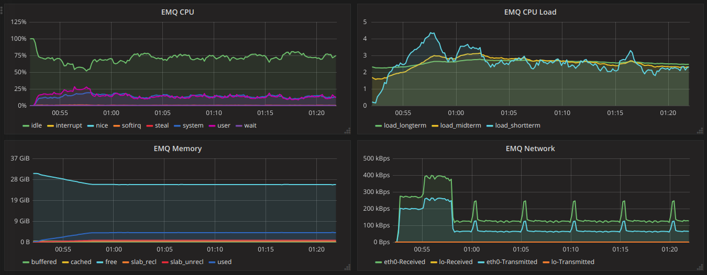
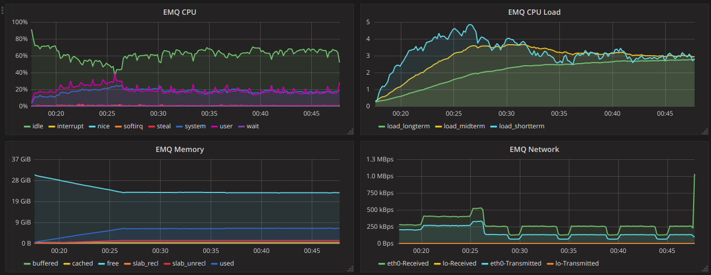
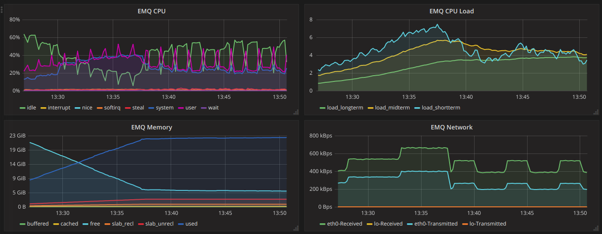
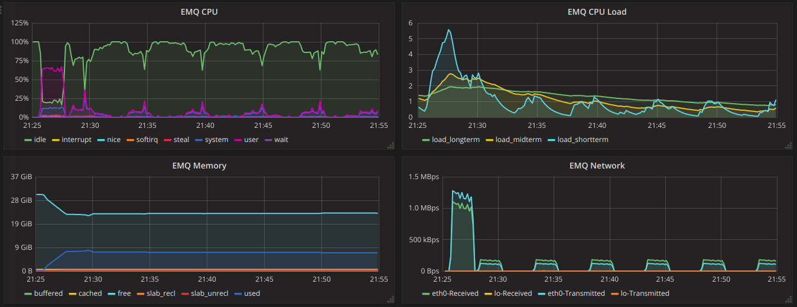
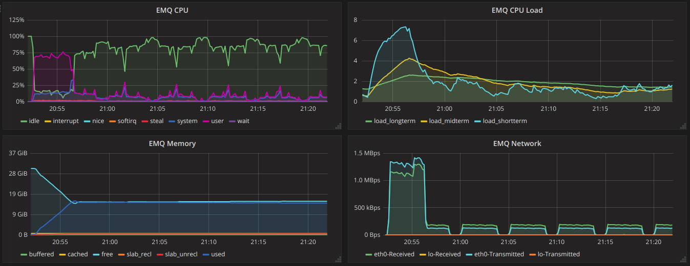
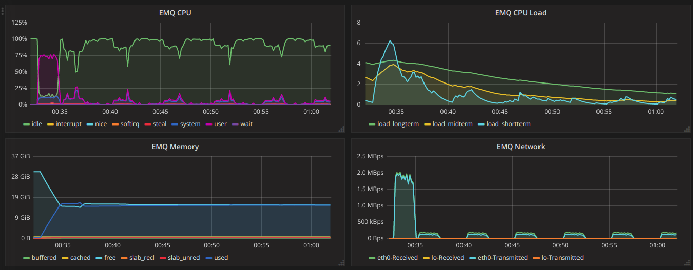
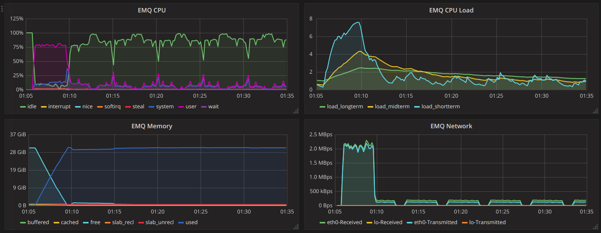

.. _connection_benchmark:

============
并发连接测试
============

该测试场景只测试客户端到服务器端的MQTT协议连接，该测试场景下除了发送MQTT协议的控制包和PING包外，不发送任何用户数据相关的包，测试目的是为了得到EMQ消息服务器在不同并发连接下的表现。

-------
TCP连接
-------

<<<<<<< HEAD
总体结果：EMQx3.0.0在建立100万以内TCP连接的时候，平均响应时间都在8ms以内，成功率为100%。内存的使用基本呈线性增长，CPU在用户连接建立的时候表现平稳，没有大幅度的抖动。但是观察到在连接断开的场景下，会发生CPU使用率会增多
=======
总体结果：EMQx3.0在建立100万以内TCP连接的时候，平均响应时间都在7ms以内，成功率为100%。内存的使用基本呈线性增长，CPU在用户连接建立的时候表现平稳，没有大幅度的抖动。但是观察到在连接断开的场景下，会发生CPU使用率会增多
>>>>>>> master

.. NOTE:: 测试机配置：1台虚拟机支持50000 VU (2个docker*25000 VU)

30万线
------

+-------------------+--------------------------+----------------------+-------------+----------------+------------------+-----------------+--------+
| 虚拟用户数量(VU)  |     每秒新增并发链接(CPS)|     总计运行时间(Sec)|  平均吞吐量 |    平均响应时间|      最大响应时间|     最小响应时间| 成功率 |
+===================+==========================+======================+=============+================+==================+=================+========+
<<<<<<< HEAD
| 300000            | 1000                     | 1800                 | 909         | 8ms            | 3.143s           | 1ms             | 100%   |
=======
| 300000            | 1000                     | 1800                 | 882         | 5ms            | 2.606s           | 1ms             | 100%   |
>>>>>>> master
+-------------------+--------------------------+----------------------+-------------+----------------+------------------+-----------------+--------+

+------------------------------+-----------------------+------------------------------------------------+
|     负载(Load)               |      CPU              |           Memory                               |
+==============================+=======================+================================================+
<<<<<<< HEAD
| CPU shortterm Load最大达到4  | CPU使用率在5%-26%之间 | Memory使用随着并发用户量增加而增大，最大到4.9G |
+------------------------------+-----------------------+------------------------------------------------+

 EMQX服务器资源监控：

=======
| CPU shortterm Load最大达到4  | CPU使用率在5%-29%之间 | Memory使用随着并发用户量增加而增大，最大到4.9G |
+------------------------------+-----------------------+------------------------------------------------+

>>>>>>> master

50万线
------

+-------------------+--------------------------+----------------------+-------------+----------------+------------------+-----------------+--------+
| 虚拟用户数量(VU)  |     每秒新增并发链接(CPS)|     总计运行时间(Sec)|  平均吞吐量 |    平均响应时间|      最大响应时间|     最小响应时间| 成功率 |
+===================+==========================+======================+=============+================+==================+=================+========+
<<<<<<< HEAD
| 500000            | 1000                     | 1800                 | 943         | 7ms            | 2.460s           | 1ms             | 100%   |
+-------------------+--------------------------+----------------------+-------------+----------------+------------------+-----------------+--------+

+------------------------------+-----------------------+------------------------------------------------+
|     负载(Load)               |      CPU              |           Memory                               |
+==============================+=======================+================================================+
| CPU shortterm Load最大达到5  | CPU使用率在15%-40%之间| Memory使用随着并发用户量增加而增大，最大到7.79G|
+------------------------------+-----------------------+------------------------------------------------+

 EMQX服务器资源监控：

=======
| 500000            | 1000                     | 1800                 | 917         | 4ms            | 3.008s           | 1ms             | 100%   |
+-------------------+--------------------------+----------------------+-------------+----------------+------------------+-----------------+--------+

+------------------------------+-----------------------+------------------------------------------------+
|     负载(Load)               |      CPU              |           Memory                               |
+==============================+=======================+================================================+
| CPU shortterm Load最大达到4  | CPU使用率在15%-35%之间| Memory使用随着并发用户量增加而增大，最大到7.79G|
+------------------------------+-----------------------+------------------------------------------------+
>>>>>>> master

100万线
-------

+-------------------+--------------------------+----------------------+-------------+----------------+------------------+-----------------+--------+
| 虚拟用户数量(VU)  |     每秒新增并发链接(CPS)|     总计运行时间(Sec)|  平均吞吐量 |    平均响应时间|      最大响应时间|     最小响应时间| 成功率 |
+===================+==========================+======================+=============+================+==================+=================+========+
| 1000000           | 1000                     | 1800                 | 960         | 7ms            | 3.707s           | 1ms             | 100%   |
+-------------------+--------------------------+----------------------+-------------+----------------+------------------+-----------------+--------+

+------------------------------+-----------------------+------------------------------------------------+
|     负载(Load)               |      CPU              |           Memory                               |
+==============================+=======================+================================================+
| CPU shortterm Load最大达到7  |CPU使用率在20%-50%之间 |Memory使用随着并发用户量增加而增大，最大到22.66G|
+------------------------------+-----------------------+------------------------------------------------+
<<<<<<< HEAD

 EMQX服务器资源监控：

=======
>>>>>>> master

-----------
SSL单向认证
-----------

<<<<<<< HEAD
总体结果：EMQX在20万连接之内单向认证的连接，并且设置不重新连接的情况下，平均响应时间在34ms以内，成功率为100%，CPU和内存使用基本正常。
=======
总体结果：EMQX在20万连接之内单向认证的连接，并且设置不重新连接的情况下，平均响应时间在15ms以内，成功率为100%，CPU和内存使用基本正常。
>>>>>>> master

.. NOTE:: 测试机配置：1台虚拟机支持20000 VU (2个docker*10000 VU)

10万线
------

+-------------------+--------------------------+----------------------+-------------+----------------+------------------+-----------------+--------+
| 虚拟用户数量(VU)  |     每秒新增并发链接(CPS)|     总计运行时间(Sec)|  平均吞吐量 |    平均响应时间|      最大响应时间|     最小响应时间| 成功率 |
+===================+==========================+======================+=============+================+==================+=================+========+
<<<<<<< HEAD
|100000             | 1000                     | 1800                 | 800         | 15ms           | 2.319s           | 6ms             | 100%   |
+-------------------+--------------------------+----------------------+-------------+----------------+------------------+-----------------+--------+

+------------------------------+-----------------------+------------------------------------------------+
|     负载(Load)               |      CPU              |           Memory                               |
+==============================+=======================+================================================+
|CPU shortterm Load最大达到5.52| CPU使用率在10%-65%之间|Memory使用随着并发用户量增加而增大，最大到8.17G |
+------------------------------+-----------------------+------------------------------------------------+

 EMQX服务器资源监控：

=======
|100000             | 500                      | 1800                 | 444         | 12ms           | 2.177s           | 5ms             | 100%   |
+-------------------+--------------------------+----------------------+-------------+----------------+------------------+-----------------+--------+

+------------------------------+-----------------------+------------------------------------------------+
|     负载(Load)               |      CPU              |           Memory                               |
+==============================+=======================+================================================+
|CPU shortterm Load最大达到3.52| CPU使用率在30%-40%之间|Memory使用随着并发用户量增加而增大，最大到12.17G|
+------------------------------+-----------------------+------------------------------------------------+
>>>>>>> master

20万线
------

+-------------------+--------------------------+----------------------+-------------+----------------+------------------+-----------------+--------+
| 虚拟用户数量(VU)  |     每秒新增并发链接(CPS)|     总计运行时间(Sec)|  平均吞吐量 |    平均响应时间|      最大响应时间|     最小响应时间| 成功率 |
+===================+==========================+======================+=============+================+==================+=================+========+
<<<<<<< HEAD
| 200000            | 1000                     | 1800                 | 870         | 15ms           | 2.479s           | 6ms             | 100%   |
=======
| 200000            | 500                      | 1800                 | 465         | 14ms           | 2.059s           | 5ms             | 100%   |
>>>>>>> master
+-------------------+--------------------------+----------------------+-------------+----------------+------------------+-----------------+--------+

+------------------------------+-----------------------+------------------------------------------------+
|     负载(Load)               |      CPU              |           Memory                               |
+==============================+=======================+================================================+
<<<<<<< HEAD
| CPU shortterm Load最大达到7  |CPU使用率在10%-75%之间 |Memory使用随着并发用户量增加而增大，最大到15.53G|
+------------------------------+-----------------------+------------------------------------------------+

 EMQX服务器资源监控：

=======
| CPU shortterm Load最大达到6  |CPU使用率在30%-50%之间 |Memory使用随着并发用户量增加而增大，最大到23.53G|
+------------------------------+-----------------------+------------------------------------------------+
>>>>>>> master

-----------
SSL双向认证
-----------

总体结果：EMQX在20万连接之内双向认证的连接，并且设置不重新连接的情况下，平均响应时间在15ms以内，成功率为100%，CPU和内存使用基本正常。

.. NOTE:: 测试机配置：1台虚拟机支持20000 VU (2个docker*10000 VU)

10万线
------

+-------------------+--------------------------+----------------------+-------------+----------------+------------------+-----------------+--------+
| 虚拟用户数量(VU)  |     每秒新增并发链接(CPS)|     总计运行时间(Sec)|  平均吞吐量 |    平均响应时间|      最大响应时间|     最小响应时间| 成功率 |
+===================+==========================+======================+=============+================+==================+=================+========+
<<<<<<< HEAD
| 100000            | 1000                     | 1800                 | 769         | 27ms           | 2.700s           | 9ms             | 100%   |
+-------------------+--------------------------+----------------------+-------------+----------------+------------------+-----------------+--------+

+------------------------------+-----------------------+------------------------------------------------+
|     负载(Load)               |      CPU              |           Memory                               |
+==============================+=======================+================================================+
| CPU shortterm Load最大达到6  |CPU使用率在10%-75%之间 |Memory使用随着并发用户量增加而增大，最大到15.81G|
+------------------------------+-----------------------+------------------------------------------------+

 EMQX服务器资源监控：

=======
| 100000            | 500                      | 1800                 | 416         | 12ms           | 2.469s           | 5ms             | 100%   |
+-------------------+--------------------------+----------------------+-------------+----------------+------------------+-----------------+--------+

+------------------------------+-----------------------+------------------------------------------------+
|     负载(Load)               |      CPU              |           Memory                               |
+==============================+=======================+================================================+
| CPU shortterm Load最大达到4  |CPU使用率在20%-44%之间 |Memory使用随着并发用户量增加而增大，最大到12.01G|
+------------------------------+-----------------------+------------------------------------------------+
>>>>>>> master

20万线
------

+-------------------+--------------------------+----------------------+-------------+----------------+------------------+-----------------+--------+
| 虚拟用户数量(VU)  |     每秒新增并发链接(CPS)|     总计运行时间(Sec)|  平均吞吐量 |    平均响应时间|      最大响应时间|     最小响应时间| 成功率 |
+===================+==========================+======================+=============+================+==================+=================+========+
<<<<<<< HEAD
| 200000            | 1000                     | 1800                 | 833         | 34ms           | 2.704s           | 9ms             | 100%   |
=======
| 200000            | 500                      | 1800                 | 454         | 12ms           | 2.340s           | 5ms             | 100%   |
>>>>>>> master
+-------------------+--------------------------+----------------------+-------------+----------------+------------------+-----------------+--------+

+------------------------------+-----------------------+------------------------------------------------+
|     负载(Load)               |      CPU              |           Memory                               |
+==============================+=======================+================================================+
<<<<<<< HEAD
| CPU shortterm Load最大达到8  |CPU使用率在10%-80%之间 |Memory使用随着并发用户量增加而增大，最大到30.52G|
+------------------------------+-----------------------+------------------------------------------------+

EMQX服务器资源监控：

=======
| CPU shortterm Load最大达到6  |CPU使用率在30%-50%之间 |Memory使用随着并发用户量增加而增大，最大到23.52G|
+------------------------------+-----------------------+------------------------------------------------+
>>>>>>> master
