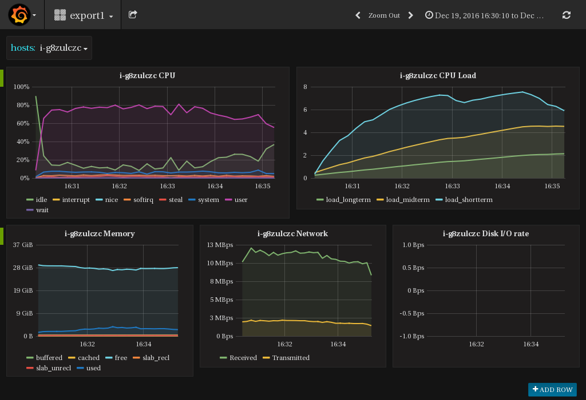
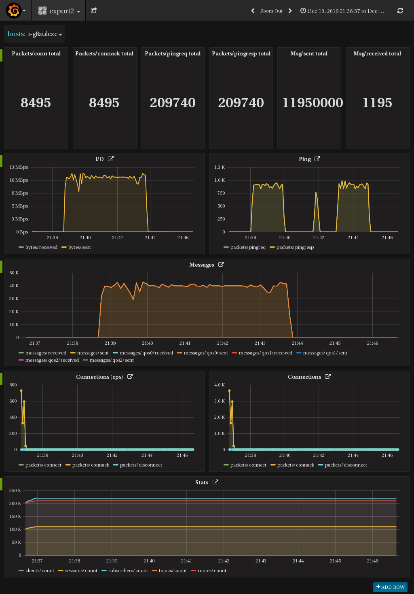
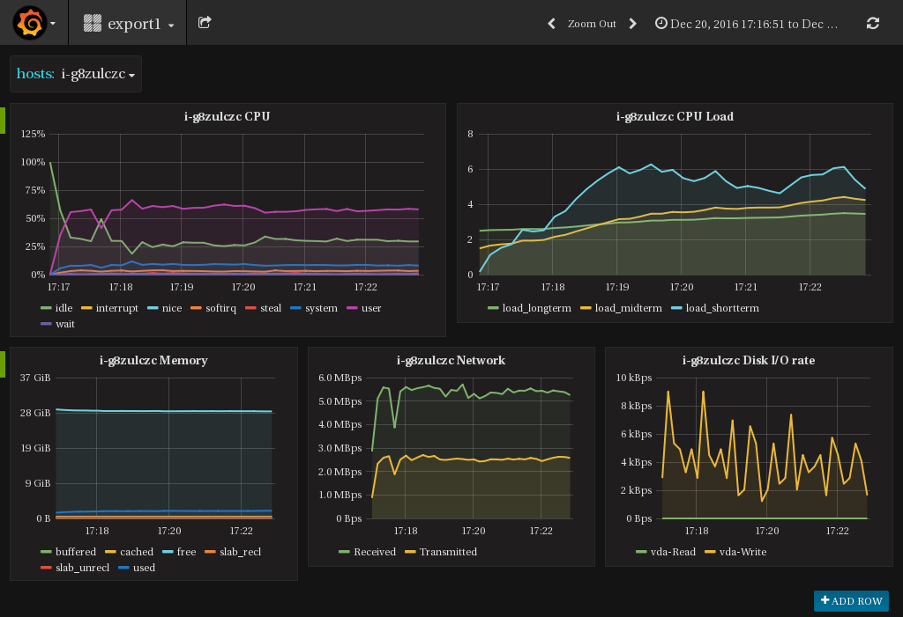
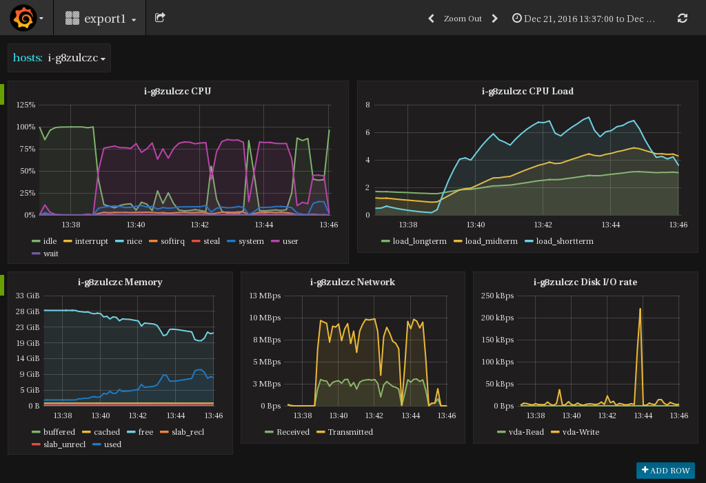
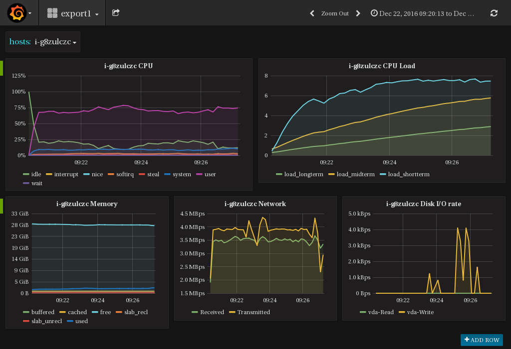
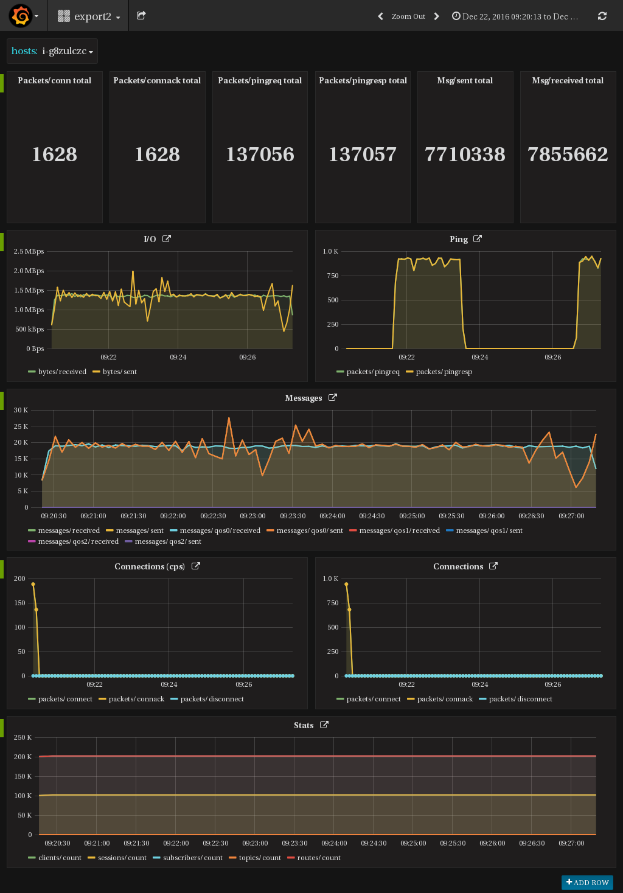
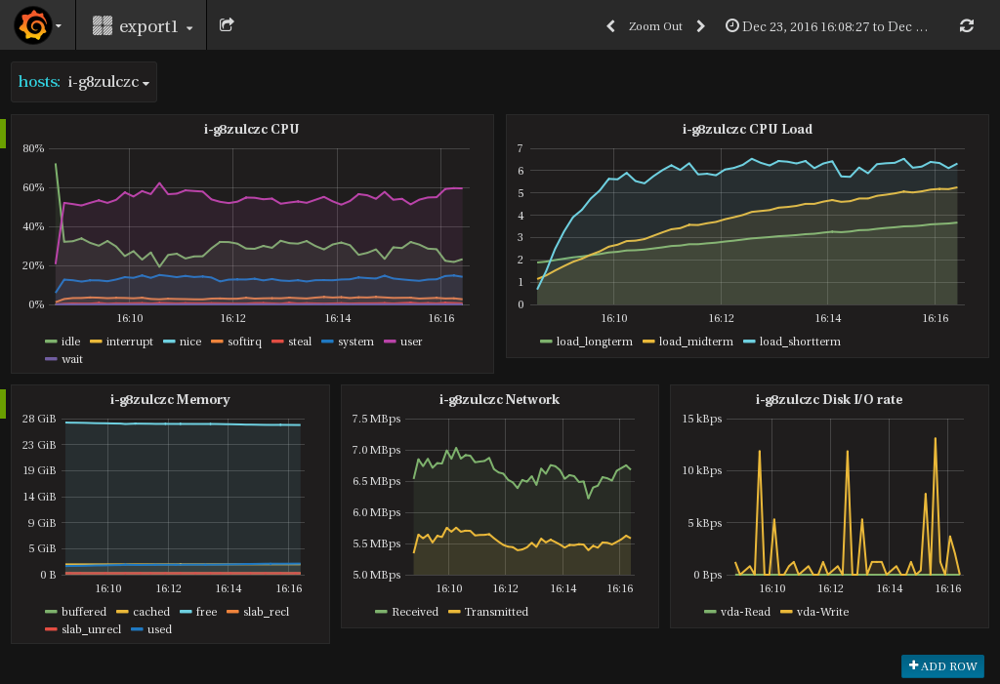
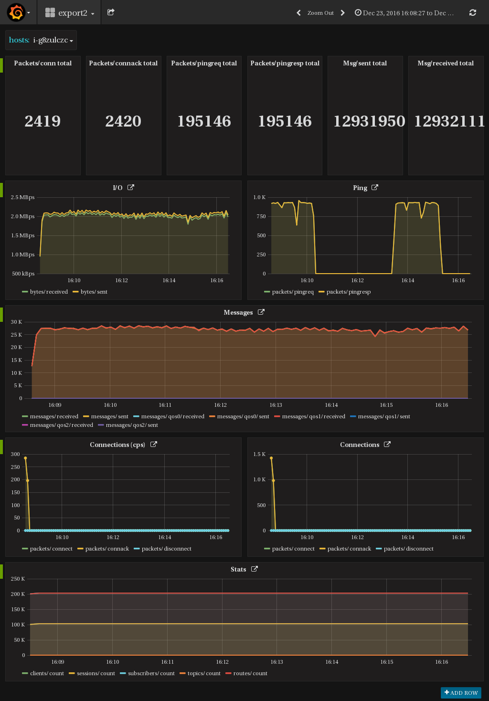

.. _throughput_benchmark:

============
消息吞吐测试
============

EMQ消息吞吐测试组合条件：

+--------------------------+-----------------------+------------------+-------------------+--------------+---------------+-------------+
|         QoS              |         Payload       | PUB连接 x Fan-In | SUB连接 X Fan-Out |  实际Fan-In  |  实际Fan-Out  |  背景连接   |
+========+========+========+========+======+=======+==================+===================+==============+===============+=============+
|   0    |   1    |    2   |  256B  |  1k  |  10K  |    C x Msg/s     |     C x Msg/s     |  Msg/s, Bps  |  Msg/s, Bps   |    100K     |
+--------+--------+--------+--------+------+-------+------------------+-------------------+--------------+---------------+-------------+

参数说明:

+-----------+-----------------------+
|  参数     |   说明                |
+-----------+-----------------------+
|  C        |   Connection连接数    |
+-----------+-----------------------+
|  Msg/s    |   每秒消息数量        |
+-----------+-----------------------+
|  Bps      |   网络吞吐(字节/秒)   |
+-----------+-----------------------+

.. NOTE:: 吞吐测试在青云北京三区进行，节点之间的网络带宽平均限制为512Mbps，峰值限制为1Gbps。

-------------------
QoS0 Fan-In消息吞吐
-------------------

测试客户端到EMQ服务器间的QoS0消息吞吐:

+-------------------------+-------+-----------+--------------------+---------------------+---------------------+-------------+
| 组合场景ID              |  QoS  |  Payload  |  PUB连接 X Fan-In  |  SUB连接 X Fan-Out  |  Fan-In(平均/峰值)  |  背景连接   | 
+=========================+=======+===========+====================+=====================+=====================+=============+
| qos0-p256-40K-0         |  0    |  256      |  4K X 10           |  0                  |  28843 / 33319      |  100K       |
+-------------------------+-------+-----------+--------------------+---------------------+---------------------+-------------+
| qos0-p1K-30K-0          |  0    |  1K       |  3K X 10           |  0                  |  25720 / 27801      |  100K       |
+-------------------------+-------+-----------+--------------------+---------------------+---------------------+-------------+
| qos0-p10K-10K-0         |  0    |  10K      |  1K X 10           |  0                  |  4480 / 7990        |  100K       |
+-------------------------+-------+-----------+--------------------+---------------------+---------------------+-------------+
| qos0-100K-1K-0          |  0    |  100K     |  1K X 1            |  0                  |  147 / 446          |  100K       |
+-------------------------+-------+-----------+--------------------+---------------------+---------------------+-------------+

.. NOTE:: 1. 测试主机的内核TCP协议栈参数: http://emqtt.com/docs/v2/tune.html#tcp, 2. 100K测试用例吞吐与报文不匹配，问题待确认。

资源占用报告:

+--------------------------+-----------------------+------------+---------------+-----------------+---------------------------+
|  组合场景ID              | 网络吞吐(Avg/Max Bps) | 负载(Load) | CPU(user/sys) | Memory(Avg/Max) | 测试报告                  |
+==========================+=======================+============+===============+=================+===========================+
|  qos0-p256-40K-0         |  /12.06M              | 7/4/2      | 不超过80% / 7%| _/3.8G          | `mqtt_pub_0_256p_10mps`_  |
+--------------------------+-----------------------+------------+---------------+-----------------+---------------------------+
|  qos0-p1K-30K-0          | _/30.88M              | 8/5/3      | 不超过93% / 3%| _/7.4G          | `mqtt_pub_0_1k_10mps`_    |
+--------------------------+-----------------------+------------+---------------+-----------------+---------------------------+
|  qos0-p10K-10K-0         | _/61.88M              | 8/5/3      | 不超过89% / 7%| _/3.8G          | `mqtt_pub_0_10k_10mps`_   |
+--------------------------+-----------------------+------------+---------------+-----------------+---------------------------+
|  qos0-100K-1K-0          | _/38.3M               | 8/6/3      | 不超过62% /22%| _/7.45G         | `mqtt_pub_0_100k_10mps`_  |
+--------------------------+-----------------------+------------+---------------+-----------------+---------------------------+

qos0-p256-40K-0资源指标监控：

qos0-p256-40K-0系统指标监控：

.. image:: ./_static/images/qos0-fanin/qos0-p256-40K-0/part2.png

--------------------
QoS0 Fan-Out消息吞吐
--------------------

+--------------------------+-------+-----------+--------------------+---------------------+---------------------+-------------+
|  组合场景ID              |  QoS  |  Payload  |  PUB连接 X Fan-In  |  SUB连接 X Fan-Out  |  Fan-Out(平均/峰值) |  背景连接   |
+==========================+=======+===========+====================+=====================+=====================+=============+
|  qos0-p256-4-40K         |  0    |  256      |  4 X 1             |  10K X 4            |  40K / 42.5K        |  100K       |
+--------------------------+-------+-----------+--------------------+---------------------+---------------------+-------------+
|  qos0-p1K-3-30K          |  0    |  1K       |  3 X 1             |  10K X 3            |  28K / 32.9K        |  100K       |
+--------------------------+-------+-----------+--------------------+---------------------+---------------------+-------------+
|  qos0-p10K-1-10K         |  0    |  10K      |  1 X 1             |  10K X 1            |  3K / 3.6K          |  100K       |
+--------------------------+-------+-----------+--------------------+---------------------+---------------------+-------------+
|  qos0-p100K-1-1K         |  0    |  100K     |  1 X 1             |  1K X 1             |  0.2K / 0.3K        |  100K       |
+--------------------------+-------+-----------+--------------------+---------------------+---------------------+-------------+

资源占用报告:

+--------------------------+-----------------------+------------+---------------+-----------------+---------------------------+
|  组合场景ID              | 网络吞吐(Avg/Max Bps) | 负载(Load) | CPU(user/sys) | Memory(Avg/Max) | 测试报告                  |
+==========================+=======================+============+===============+=================+===========================+
|  qos0-p256-4-40K         | _16.89M               | 8/5/3      | 不超过87% / 7%| _/2.4G          | `mqtt_sub_0_256p_1mps`_   |
+--------------------------+-----------------------+------------+---------------+-----------------+---------------------------+
|  qos0-p1K-3-30K          | _/33M                 | 8/4/2      | 不超过93% / 6%| _/4.4G          | `mqtt_sub_0_1kp_1mps`_    |
+--------------------------+-----------------------+------------+---------------+-----------------+---------------------------+
|  qos0-p10K-1-10K         | _/37.5M               | 8/5/2      | 不超过60% /19%| _/6.0G          | `mqtt_sub_0_10kp_1mps`_   |
+--------------------------+-----------------------+------------+---------------+-----------------+---------------------------+
|  qos0-p100K-1-1K         | _/30.49M              | 8/5/3      | 不超过52% /19%| _/7.82G         | `mqtt_sub_0_100k_1mps`_   |
+--------------------------+-----------------------+------------+---------------+-----------------+---------------------------+

qos0-p256-4-40K资源指标监控：

.. image:: ./_static/images/qos0-fanout/qos0-p256-4-40K/part1.png

qos0-p256-4-40K系统指标监控：

-------------------
QoS1 Fan-In消息吞吐
-------------------

+--------------------------+-------+-----------+--------------------+---------------------+---------------------+------------+
|  组合场景ID              |  QoS  |  Payload  |  PUB连接 X Fan-In  |  SUB连接 X Fan-Out  |  Fan-In(平均/峰值)  |  背景连接  |
+==========================+=======+===========+====================+=====================+=====================+============+
|  qos1-p256-30K-0         |  1    |  256      |  3K X 10           |  0                  |  16.6K / 19.3K      |  100K      |
+--------------------------+-------+-----------+--------------------+---------------------+---------------------+------------+
|  qos1-p1K-20K-0          |  1    |  1K       |  2K X 10           |  0                  |  13.9K / 15.4K      |  100K      |
+--------------------------+-------+-----------+--------------------+---------------------+---------------------+------------+
|  qos1-p10K-5K-0          |  1    |  10K      |  1K X 5            |  0                  |  3.8K / 4.6K        |  100K      |
+--------------------------+-------+-----------+--------------------+---------------------+---------------------+------------+

资源占用报告:

+--------------------------+-----------------------+------------+---------------+-----------------+---------------------------+
|  组合场景ID              | 网络吞吐(Avg/Max Bps) | 负载(Load) | CPU(user/sys) | Memory(Avg/Max) | 测试报告                  |
+==========================+=======================+============+===============+=================+===========================+
|  qos1-p256-30K-0         | _/7.36M               | 7/5/2      | 不超过64% /10%| _/1.98G         | `mqtt_pub_1_256p_10mps`_  |
+--------------------------+-----------------------+------------+---------------+-----------------+---------------------------+
|  qos1-p1K-20K-0          | _/17.239M             | 6/5/2      | 不超过71% / 8%| _/2.26G         | `mqtt_pub_1_1kp_10mps`_   |
+--------------------------+-----------------------+------------+---------------+-----------------+---------------------------+
|  qos1-p10K-5K-0          | _/45.98M              | 8/5/3      | 不超过81% / 9%| _/2.236G        | `mqtt_pub_1_10kp_5mps`_   |
+--------------------------+-----------------------+------------+---------------+-----------------+---------------------------+

qos1-p256-30K-0资源指标监控：

.. image:: ./_static/images/qos1-fanin/qos1-p256-30K-0/part1.png

qos1-p256-30K-0系统指标监控：

.. image:: ./_static/images/qos1-fanin/qos1-p256-30K-0/part2.png

--------------------
QoS1 Fan-Out消息吞吐
--------------------

+--------------------------+-------+-----------+--------------------+---------------------+---------------------+-------------+
|  组合场景ID              |  QoS  |  Payload  |  PUB连接 X Fan-In  |  SUB连接 X Fan-Out  |  Fan-Out(平均/峰值) |  背景连接   |
+==========================+=======+===========+====================+=====================+=====================+=============+
|  qos1-p256-4-40K         |  1    |  256      |  4 X 1             |  10K X 4            |  23K / 27.7K        |  100K       |
+--------------------------+-------+-----------+--------------------+---------------------+---------------------+-------------+
|  qos1-p1K-3-30K          |  1    |  1K       |  3 X 1             |  10K X 3            |  17.5 / 20.5K       |  100K       |
+--------------------------+-------+-----------+--------------------+---------------------+---------------------+-------------+
|  qos1-p10k-1-5K          |  1    |  10K      |  1 X 1             |  5K X 1             |  4906 / 5000        |  100K       |
+--------------------------+-------+-----------+--------------------+---------------------+---------------------+-------------+

资源占用报告:

+--------------------------+-----------------------+------------+----------------+-----------------+---------------------------+
|  组合场景ID              | 网络吞吐(Avg/Max Bps) | 负载(Load) | CPU(user/sys)  | Memory(Avg/Max) | 测试报告                  |
+==========================+=======================+============+================+=================+===========================+
|  qos1-p256-4-40K         | _/11.44M              | 8/5/2      | 不超过80% / 8% | _/2.504G        | `mqtt_sub_1_256_10mps`_   |
+--------------------------+-----------------------+------------+----------------+-----------------+---------------------------+
|  qos1-p1k-3-30K          | _/24.44M              | 7/5/3      | 不超过84% / 7% | _/3.20G         | `mqtt_sub_1_1kp_10mps`_   |
+--------------------------+-----------------------+------------+----------------+-----------------+---------------------------+
|  qos1-p10k-1-5K          | _/64.8M               | 8/5/3      | 不超过64% / 15%| _/26.67G        | `mqtt_sub_1_10k_5mps`_    |
+--------------------------+-----------------------+------------+----------------+-----------------+---------------------------+

qos1-p256-4-40K资源指标监控：

.. image:: ./_static/images/qos1-fanout/qos1-p256-4-40K/part1.png

qos1-p256-4-40K系统指标监控：

.. image:: ./_static/images/qos1-fanout/qos1-p256-4-40K/part2.png

-------------------
QoS2 Fan-In消息吞吐
-------------------

+--------------------------+-------+-----------+--------------------+---------------------+---------------------+-------------+
|  组合场景ID              |  QoS  |  Payload  |  PUB连接 X Fan-In  |  SUB连接 X Fan-Out  |  Fan-In(平均/峰值)  |  背景连接   |
+==========================+=======+===========+====================+=====================+=====================+=============+
|  qos2-p256-20K-0         |  2    |  256      |  4k X 5            |  0                  |  9.6K  / 10.5K      |  100K       |
+--------------------------+-------+-----------+--------------------+---------------------+---------------------+-------------+
|  qos2-p1K-10K-0          |  2    |  1K       |  2k X 5            |  0                  |  6.4K  / 6.9K       |  100K       |
+--------------------------+-------+-----------+--------------------+---------------------+---------------------+-------------+
|  qos2-p10K-3k-0          |  2    |  10K      |  600 X 5           |  0                  |  225  / 409         |  100K       |
+--------------------------+-------+-----------+--------------------+---------------------+---------------------+-------------+

资源占用报告:

+--------------------------+-----------------------+------------+---------------+-----------------+---------------------------+
|  组合场景ID              | 网络吞吐(Avg/Max Bps) | 负载(Load) | CPU(user/sys) | Memory(Avg/Max) | 测试报告                  |
+==========================+=======================+============+===============+=================+===========================+
|  qos2-p256-20K-0         | _/5.712M              | 6/4/3      | 不超过66% /12%| _/2.02G         | `mqtt_pub_2_256p_5mps`_   |
+--------------------------+-----------------------+------------+---------------+-----------------+---------------------------+
|  qos2-p1k-10K-0          | _/8.87M               | 7/5/4      | 不超过58% / 9%| _/1.98G         | `mqtt_pub_2_1kp_5mps`_    |
+--------------------------+-----------------------+------------+---------------+-----------------+---------------------------+
|  qos2-p10k-3k-0          | _/39.4M               | 8/6/4      | 不超过70% /13%| _/5.822G        | `mqtt_pub_2_10kp_5mps`_   |
+--------------------------+-----------------------+------------+---------------+-----------------+---------------------------+

qos2-p256-20K-0资源指标监控：

qos2-p256-20K-0系统指标监控：

.. image:: ./_static/images/qos2-fanin/qos2-p256-20K-0/part2.png

--------------------
QoS2 Fan-Out消息吞吐
--------------------

+--------------------------+-------+-----------+--------------------+---------------------+---------------------+-------------+
|  组合场景ID              |  QoS  |  Payload  |  PUB连接 X Fan-In  |  SUB连接 X Fan-Out  | Fan-Out(平均/峰值)  |  背景连接   |
+==========================+=======+===========+====================+=====================+=====================+=============+
|  qos2-p256-4-20K         |  2    |  256      |  4 X 1             |  5K X 4             |  16.8K/18K          |  100K       |
+--------------------------+-------+-----------+--------------------+---------------------+---------------------+-------------+
|  qos2-p1K-2-10K          |  2    |  1K       |  2 X 1             |  5K X 2             |  10K/10.2K          |  100K       |
+--------------------------+-------+-----------+--------------------+---------------------+---------------------+-------------+
|  qos2-p10K-1-1K          |  2    |  10K      |  1 X 1             |  1K X 1             |  200/400            |  100K       |
+--------------------------+-------+-----------+--------------------+---------------------+---------------------+-------------+

资源占用报告:

+--------------------------+-----------------------+------------+---------------+-----------------+---------------------------+
|  组合场景ID              | 网络吞吐(Avg/Max Bps) | 负载(Load) | CPU(user/sys) | Memory(Avg/Max) | 测试报告                  |
+==========================+=======================+============+===============+=================+===========================+
|  qos2-p256-4-20K         |  _/9.81M              | 7/4/3      | 不超过86%/8%  |     10.69G      | `mqtt_sub_2_256p_1mps`_   |
+--------------------------+-----------------------+------------+---------------+-----------------+---------------------------+
|  qos2-p1k-2-10K          |  _/14.14              | 7/6/4      | 不超过75%/11% |     2.645G      | `mqtt_sub_2_1kp_1mps`_    |
+--------------------------+-----------------------+------------+---------------+-----------------+---------------------------+
|  qos2-p10k-1-1K          |  _/25.29M             | 8/6/5      | 不超过46%/21% |     7.45G       | `mqtt_sub_2_10kp_1mps`_   |
+--------------------------+-----------------------+------------+---------------+-----------------+---------------------------+

qos2-p256-4-20K资源指标监控：

qos2-p256-4-20K系统指标监控：

.. image:: ./_static/images/qos2-fanout/qos2-p256-4-20K/part2.png

--------------
共享订阅
--------------

订阅方式: $queue/<topic> 或 $share/<group>/<topic>

+--------------------------+-------+-----------+--------------------+---------------------+---------------------+---------------------+-------------+
|  组合场景ID              |  QoS  |  Payload  |  PUB连接 X Fan-In  |  SUB连接 X Fan-Out  |  Fan-In (平均/峰值) |  Fan-Out(平均/峰值) |  背景连接   |
+==========================+=======+===========+====================+=====================+=====================+=====================+=============+
|  qos0-p64-20K-20K        |  0    |  64       |  2K X 10           |  10 X 2K            |  18.6K / 19.2K      |  19.5K/27.6K        |  100K       |
+--------------------------+-------+-----------+--------------------+---------------------+---------------------+---------------------+-------------+
|  qos0-p256-20K-20K       |  0    |  256      |  2K X 10           |  10 X 2K            |  18.5 /  19.3K      |   8.4 / 23.0K       |  100K       |
+--------------------------+-------+-----------+--------------------+---------------------+---------------------+---------------------+-------------+
|  qos1-p64-15K-15K        |  1    |  64       |  1.5K X 10         |  10 X 1.5K          |  12.5 / 13.3K       |  12.7k/ 13.3k       |  100K       |
+--------------------------+-------+-----------+--------------------+---------------------+---------------------+---------------------+-------------+
|  qos1-p256-15K-15K       |  1    |  256      |  1.5K X 10         |  10 X 1.5K          |  7.7K/ 13.4K        |  5.8k/ 13.5K        |  100K       |
+--------------------------+-------+-----------+--------------------+---------------------+---------------------+---------------------+-------------+
|  qos2-p64-10K-10K        |  2    |  64       |  1K X 10           |  10 X 1K            |  5.9k / 8.9 K       |  4.1k / 9.18K       |  100K       |
+--------------------------+-------+-----------+--------------------+---------------------+---------------------+---------------------+-------------+
|  qos2-p256-7 K-10K       |  2    |  256      | 0.7K X 10          |  10 X 0.7K          |  6.3K / 6.8K        |  6.5K / 6.75K       |  100K       |
+--------------------------+-------+-----------+--------------------+---------------------+---------------------+---------------------+-------------+

资源占用报告:

+---------------------+-----------------------+------------+---------------+-----------------+--------------------------------+
|  组合场景ID         | 网络吞吐(RX / TX Bps) | 负载(Load) | CPU(user/sys) | Memory(Avg/Max) | 测试报告                       |
+=====================+=======================+============+===============+=================+================================+
|  qos0-p64-20K-20K   |   3.6 / 4.4M          | 8/6/3      |  76%/10%      | 2.08M           |  `mqtt_share_pub_0_64p`_       |
+---------------------+-----------------------+------------+---------------+-----------------+--------------------------------+
|  qos0-p256-20K-20K  |   7.8 / 7.7M          | 7/6/4      |  76%/10%      | 6.7M            |  `mqtt_share_pub_0_256p`_      |
+---------------------+-----------------------+------------+---------------+-----------------+--------------------------------+
|  qos1-p64-20K-20K   |   3.5 / 2.9M          | 7/5/3      |  65%/8%       | 1.86M           |  `mqtt_share_pub_1_64p`_       |
+---------------------+-----------------------+------------+---------------+-----------------+--------------------------------+
|  qos1-p256-20K-20K  |   3.7 / 3.7M          | 8/6/4      |  87%/10%      | 4.02M           |  `mqtt_share_pub_1_256p`_      |
+---------------------+-----------------------+------------+---------------+-----------------+--------------------------------+
|  qos2-p64-10K-10K   |   4.0 / 3.0M          | 8/7/5      |  89%/8%       | 2.9M            |  `mqtt_share_pub_2_64p`_       |
+---------------------+-----------------------+------------+---------------+-----------------+--------------------------------+
|  qos2-p256-7K-10K   |   4.3 / 3.6M          | 7/5/4      |  70%/9%       | 1.85M           |  `mqtt_share_pub_2_256p`_      |
+---------------------+-----------------------+------------+---------------+-----------------+--------------------------------+

qos0-p64-20K-20K资源指标监控：

qos0-p64-20K-20K系统指标监控：

----------------------
Fastlane共享订阅
----------------------

订阅方式: $fastlane/$queue/<topic> 或 $fastlane/$share/<group>/<topic>

+--------------------------+-------+-----------+--------------------+---------------------+---------------------+---------------------+-------------+
|  组合场景ID              |  QoS  |  Payload  |  PUB连接 X Fan-In  |  SUB连接 X Fan-Out  |  Fan-In (平均/峰值) |  Fan-Out(平均/峰值) |  背景连接   |
+==========================+=======+===========+====================+=====================+=====================+=====================+=============+
|  qos1-p64-30K-30K        |  1    |  64       |  3K X 10           |  15 X 2K            |  26.9K / 28.5K      |  27.7K/28.4K        |  100K       |
+--------------------------+-------+-----------+--------------------+---------------------+---------------------+---------------------+-------------+

资源占用报告:

+--------------------------+-----------------------+------------+---------------+-----------------+---------------------------+
|  组合场景ID              | 网络吞吐(Rx /Tx  Bps) | 负载(Load) | CPU(user/sys) | Memory(Avg/Max) | 测试报告                  |
+==========================+=======================+============+===============+=================+===========================+
|  qos1-p64-30K-30K        |    7.03 / 5.75M       | 6/4/3      |  62%/15%      |  1.96G          |   `mqtt_fastlane_1_64p`_  |
+--------------------------+-----------------------+------------+---------------+-----------------+---------------------------+

qos1-p64-30K-30K资源指标监控：

qos1-p64-30K-30K系统指标监控：

.. _mqtt_pub_0_256p_10mps: https://www.xmeter.net/commercialPage.html#/testrunMonitor/1423085729
.. _mqtt_pub_0_1k_10mps: https://www.xmeter.net/commercialPage.html#/testrunMonitor/809361614
.. _mqtt_pub_0_10k_10mps: https://www.xmeter.net/commercialPage.html#/testrunMonitor/2096357643
.. _mqtt_pub_0_100k_10mps: https://www.xmeter.net/commercialPage.html#/testrunMonitor/605637990
.. _mqtt_sub_0_256p_1mps: https://www.xmeter.net/commercialPage.html#/testrunMonitor/1356775835
.. _mqtt_sub_0_1kp_1mps: https://www.xmeter.net/commercialPage.html#/testrunMonitor/1363767301
.. _mqtt_sub_0_10kp_1mps: https://www.xmeter.net/commercialPage.html#/testrunMonitor/1106046395
.. _mqtt_sub_0_100k_1mps: https://www.xmeter.net/commercialPage.html#/testrunMonitor/1360282139
.. _mqtt_pub_1_256p_10mps: https://www.xmeter.net/commercialPage.html#testrunMonitor/1668250312
.. _mqtt_pub_1_1kp_10mps: https://www.xmeter.net/commercialPage.html#testrunMonitor/1436230490
.. _mqtt_pub_1_10kp_5mps: https://www.xmeter.net/commercialPage.html#testrunMonitor/1811352442
.. _mqtt_sub_1_256_10mps: https://www.xmeter.net/commercialPage.html#testrunMonitor/572548073
.. _mqtt_sub_1_1kp_10mps:  https://www.xmeter.net/commercialPage.html#testrunMonitor/1053775356
.. _mqtt_sub_1_10k_5mps:  https://www.xmeter.net/commercialPage.html#testrunMonitor/1948638282
.. _mqtt_pub_2_256p_5mps: https://www.xmeter.net/commercialPage.html#testrunMonitor/246653627
.. _mqtt_pub_2_1kp_5mps: https://www.xmeter.net/commercialPage.html#testrunMonitor/570500370
.. _mqtt_pub_2_10kp_5mps: https://www.xmeter.net/commercialPage.html#testrunMonitor/919262221
.. _mqtt_sub_2_256p_1mps:  https://www.xmeter.net/commercialPage.html#testrunMonitor/1040534395
.. _mqtt_sub_2_1kp_1mps:  https://www.xmeter.net/commercialPage.html#testrunMonitor/1924552406
.. _mqtt_sub_2_10kp_1mps: https://www.xmeter.net/commercialPage.html#testrunMonitor/2103198455

.. _mqtt_share_pub_0_64p: https://www.xmeter.net/commercialPage.html#testrunMonitor/1426343273
.. _mqtt_share_sub_0_64p: https://www.xmeter.net/commercialPage.html#testrunMonitor/1899343277
.. _mqtt_share_pub_0_256p: https://www.xmeter.net/commercialPage.html#testrunMonitor/1027304452
.. _mqtt_share_sub_0_256p: https://www.xmeter.net/commercialPage.html#testrunMonitor/70678968
.. _mqtt_share_pub_1_64p: https://www.xmeter.net/commercialPage.html#testrunMonitor/1125123835
.. _mqtt_share_sub_1_64p: https://www.xmeter.net/commercialPage.html#testrunMonitor/1174418846
.. _mqtt_share_pub_1_256p: https://www.xmeter.net/commercialPage.html#testrunMonitor/1507103581
.. _mqtt_share_sub_1_256p: https://www.xmeter.net/commercialPage.html#testrunMonitor/286730811
.. _mqtt_share_pub_2_64p: https://www.xmeter.net/commercialPage.html#testrunMonitor/172062198
.. _mqtt_share_sub_2_64p: https://www.xmeter.net/commercialPage.html#testrunMonitor/1846810654
.. _mqtt_share_pub_2_256p: https://www.xmeter.net/commercialPage.html#testrunMonitor/2138435555
.. _mqtt_share_sub_2_256p: https://www.xmeter.net/commercialPage.html#testrunMonitor/640504672
.. _mqtt_fastlane_1_64p: https://www.xmeter.net/commercialPage.html#testrunMonitor/1628045793

