.. _throughput_benchmark:

============
消息吞吐测试
============

EMQX消息吞吐测试组合条件：

+---------+-----------------------+------------------+-------------------+-------------+---------------+-----------+
|  QoS    |         Payload       | PUB连接 x Fan-In | SUB连接 X Fan-Out |  实际Fan-In |  实际Fan-Out  |  背景连接 |
+=========+=======================+==================+===================+=============+===============+===========+
| 0/1/2   | 64B/256B/1k/10K/100k  | C x Msg/s        | C x Msg/s         | Msg/s, Bps  | Msg/s, Bps    | 100K      |
+---------+-----------------------+------------------+-------------------+-------------+---------------+-----------+

参数说明:

+----------+-----------------------+
|  参数    |   说明                |
+==========+=======================+
| C        | Connection连接数      |
+----------+-----------------------+
| Msg/s    | 每秒消息数量          |
+----------+-----------------------+
| Bps      | 网络吞吐(字节/秒)     |
+----------+-----------------------+

.. NOTE:: 吞吐测试在青云北京三区VPC进行，节点之间的网络带宽平均限制为1Gbps，峰值限制为2Gbps。

-------------------
QoS0 Fan-In消息吞吐
-------------------

测试客户端到EMQ服务器间的QoS0消息吞吐:

+------------------------+-------+-----------+-------------------+---------------------+------------------+-----------+
| 组合场景ID             |  QoS  |  Payload  |  PUB连接 X Fan-In |  SUB连接 X Fan-Out  | Fan-In(平均吞吐) |  背景连接 |
+========================+=======+===========+===================+=====================+==================+===========+
| qos0-p256-40K-0        | 0     | 256       | 4K X 10           | 0                   | 36137            | 100K      |
+------------------------+-------+-----------+-------------------+---------------------+------------------+-----------+
| qos0-p1K-30K-0         | 0     | 1K        | 3K X 10           | 0                   | 27500            | 100K      |
+------------------------+-------+-----------+-------------------+---------------------+------------------+-----------+
| qos0-p10K-10K-0        | 0     | 10K       | 1K X 10           | 0                   | 9259             | 100K      |
+------------------------+-------+-----------+-------------------+---------------------+------------------+-----------+
| qos0-p100K-1K-0        | 0     | 100K      | 1K X 1            | 0                   | 990              | 100K      |
+------------------------+-------+-----------+-------------------+---------------------+------------------+-----------+

.. NOTE:: 1. 测试主机的内核TCP协议栈参数: https://developer.emqx.io/docs/emq/v3/en/tune.html

资源占用报告:

+-------------------------+-----------------------+------------------------+----------------+-------------+
| 组合场景ID              | 网络吞吐(Avg/Max Bps) | CPU负载(ShortLoad Max) | CPU(user/sys)  | Memory(Max) |
+=========================+=======================+========================+================+=============+
| qos0-p256-40K-0         | _/13.40M              | 6                      | 不超过45% / 25%| 2.10G       |
+-------------------------+-----------------------+------------------------+----------------+-------------+
| qos0-p1K-30K-0          | _/31.50M              | 6                      | 不超过40% / 20%| 2.05G       |
+-------------------------+-----------------------+------------------------+----------------+-------------+
| qos0-p10K-10K-0         | _/96.50M              | 4                      | 不超过32% / 12%| 2.09G       |
+-------------------------+-----------------------+------------------------+----------------+-------------+
| qos0-p100K-1K-0         | _/102.00M             | 5                      | 不超过32% / 8% | 2.40G       |
+-------------------------+-----------------------+------------------------+----------------+-------------+

qos0-p256-40K-0 EMQX服务器资源监控：

.. image:: _static/images/qos0-p256-40K-0.png

qos0-p1K-30K-0 EMQX服务器资源监控：

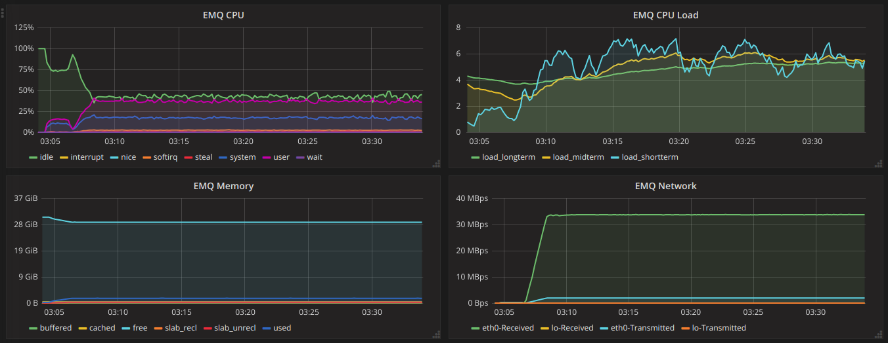

qos0-p10K-10K-0 EMQX服务器资源监控：

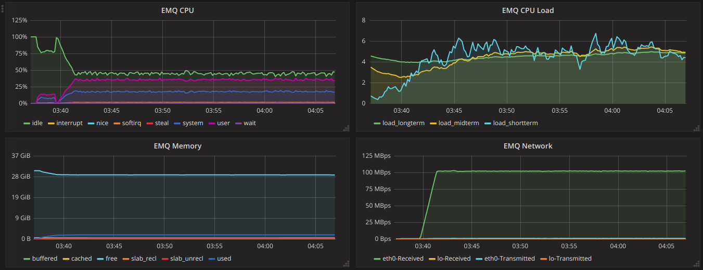

qos0-p100K-1K-0 EMQX服务器资源监控：

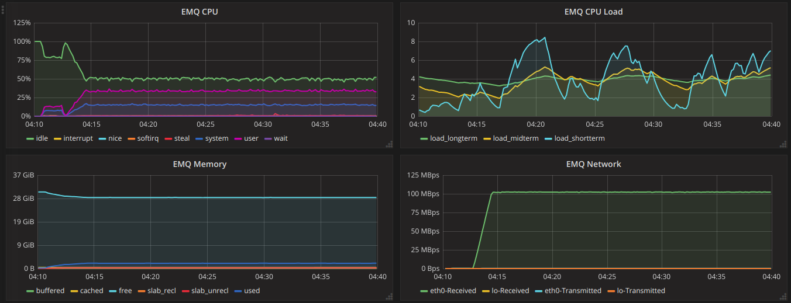

--------------------
QoS0 Fan-Out消息吞吐
--------------------

+-------------------------+-------+-----------+-------------------+---------------------+--------------------+------------+
|  组合场景ID             |  QoS  |  Payload  |  PUB连接 X Fan-In |  SUB连接 X Fan-Out  |  Fan-Out(平均吞吐) |  背景连接  |
+=========================+=======+===========+===================+=====================+====================+============+
| qos0-p256-4-40K         | 0     | 256       | 4 X 1             | 10K X 4             | 39483              | 100K       |
+-------------------------+-------+-----------+-------------------+---------------------+--------------------+------------+
| qos0-p1K-3-30K          | 0     | 1K        | 3 X 1             | 10K X 3             | 29747              | 100K       |
+-------------------------+-------+-----------+-------------------+---------------------+--------------------+------------+
| qos0-p10K-1-10K         | 0     | 10K       | 1 X 1             | 10K X 1             | 7906               | 100K       |
+-------------------------+-------+-----------+-------------------+---------------------+--------------------+------------+
| qos0-p100K-1-1K         | 0     | 100K      | 1 X 1             | 1K X 1              | 991                | 100K       |
+-------------------------+-------+-----------+-------------------+---------------------+--------------------+------------+

资源占用报告:

+-------------------------+-----------------------+------------------------+----------------+-------------+
| 组合场景ID              | 网络吞吐(Avg/Max Bps) | CPU负载(ShortLoad Max) | CPU(user/sys)  | Memory(Max) |
+=========================+=======================+========================+================+=============+
| qos0-p256-4-40K         | _/21.00M              | 5                      | 不超过30% / 8% | 2.42G       |
+-------------------------+-----------------------+------------------------+----------------+-------------+
| qos0-p1K-3-30K          | _/44.00M              | 6                      | 不超过30% / 10%| 2.55G       |
+-------------------------+-----------------------+------------------------+----------------+-------------+
| qos0-p10K-1-10K         | _/100.00M             | 2                      | 不超过15% / 6% | 2.42G       |
+-------------------------+-----------------------+------------------------+----------------+-------------+
| qos0-p100K-1-1K         | _/105.00M             | 1                      | 不超过 8% / 3% | 2.02G       |
+-------------------------+-----------------------+------------------------+----------------+-------------+

qos0-p256-4-40K  EMQX服务器资源监控：

.. image:: _static/images/qos0-p256-4-40K.png

qos0-p1K-3-30K  EMQX服务器资源监控：

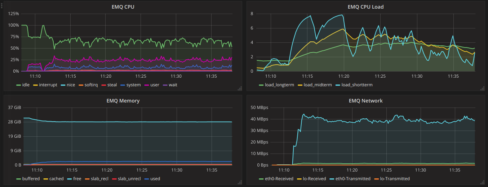

qos0-p10K-1-10K  EMQX服务器资源监控：

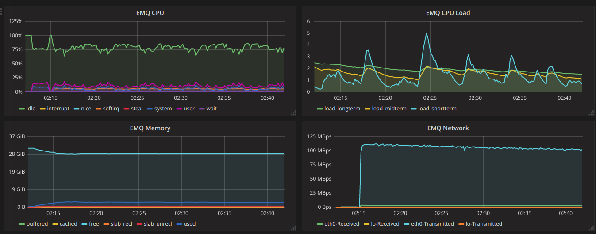

qos0-p100K-1-1K  EMQX服务器资源监控：

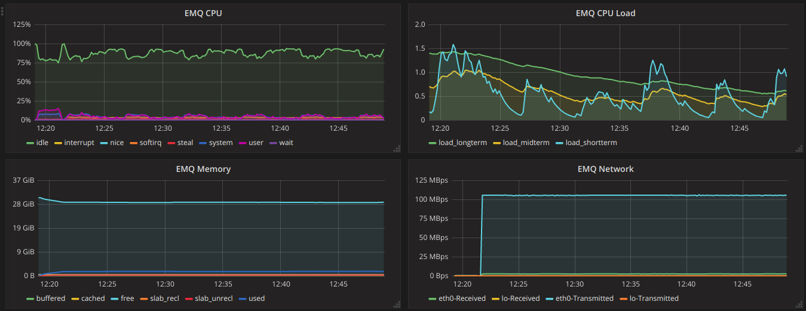

-------------------
QoS1 Fan-In消息吞吐
-------------------

+-------------------------+-------+-----------+-------------------+---------------------+--------------------+------------+
|  组合场景ID             |  QoS  |  Payload  |  PUB连接 X Fan-In |  SUB连接 X Fan-Out  |  Fan-Out(平均吞吐) |  背景连接  |
+=========================+=======+===========+===================+=====================+====================+============+
| qos1-p256-30K-0         | 1     | 256       | 3K X 10           | 0                   | 24041              | 100K       |
+-------------------------+-------+-----------+-------------------+---------------------+--------------------+------------+
| qos1-p1K-20K-0          | 1     | 1K        | 2K X 10           | 0                   | 17665              | 100K       |
+-------------------------+-------+-----------+-------------------+---------------------+--------------------+------------+
| qos1-p10K-5K-0          | 1     | 10K       | 1K X 5            | 0                   | 4517               | 100K       |
+-------------------------+-------+-----------+-------------------+---------------------+--------------------+------------+

资源占用报告:

+-------------------------+-----------------------+------------------------+----------------+-------------+
| 组合场景ID              | 网络吞吐(Avg/Max Bps) | CPU负载(ShortLoad Max) | CPU(user/sys)  | Memory(Max) |
+=========================+=======================+========================+================+=============+
| qos1-p256-30K-0         | _/10.06M              | 6                      | 不超过37% / 21%| 2.08G       |
+-------------------------+-----------------------+------------------------+----------------+-------------+
| qos1-p1K-20K-0          | _/21.41M              | 6                      | 不超过30% / 17%| 1.82G       |
+-------------------------+-----------------------+------------------------+----------------+-------------+
| qos1-p10K-5K-0          | _/48.00M              | 5                      | 不超过25% / 11%| 2.07G       |
+-------------------------+-----------------------+------------------------+----------------+-------------+

qos1-p256-30K-0 EMQX服务器资源监控：

.. image:: _static/images/qos1-p256-30K-0.png

qos1-p1K-20K-0 EMQX服务器资源监控：

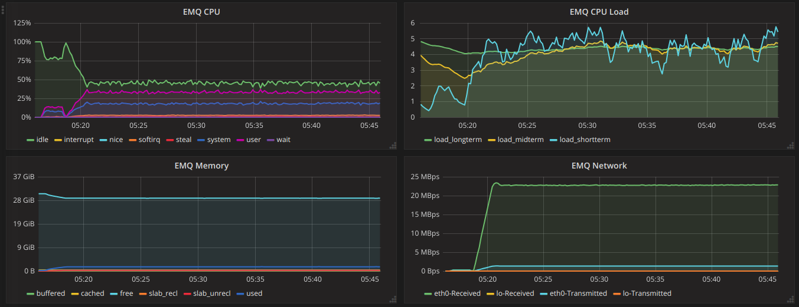

qos1-p10K-5K-0 EMQX服务器资源监控：

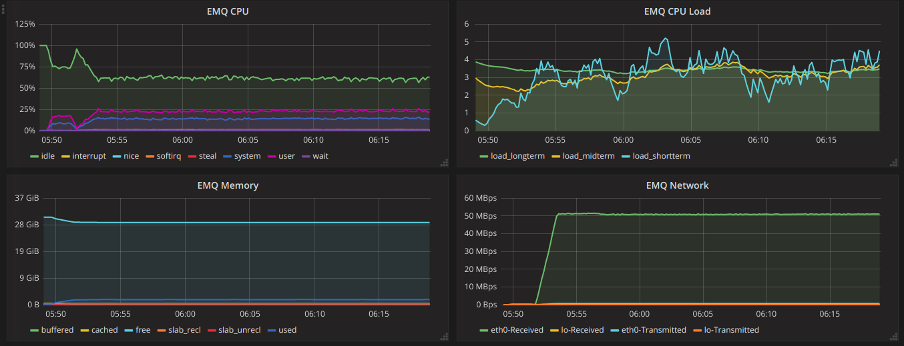

--------------------
QoS1 Fan-Out消息吞吐
--------------------

+-------------------------+-------+-----------+-------------------+---------------------+--------------------+------------+
|  组合场景ID             |  QoS  |  Payload  |  PUB连接 X Fan-In |  SUB连接 X Fan-Out  |  Fan-Out(平均吞吐) |  背景连接  |
+=========================+=======+===========+===================+=====================+====================+============+
| qos1-p256-4-40K         | 1     | 256       | 4 X 1             | 10K X 4             | 33550              | 100K       |
+-------------------------+-------+-----------+-------------------+---------------------+--------------------+------------+
| qos1-p1K-3-30K          | 1     | 1K        | 3 X 1             | 10K X 3             | 25145              | 100K       |
+-------------------------+-------+-----------+-------------------+---------------------+--------------------+------------+
| qos1-p10k-1-5K          | 1     | 10K       | 1 X 1             | 5K X 1              | 4087               | 100K       |
+-------------------------+-------+-----------+-------------------+---------------------+--------------------+------------+

资源占用报告:

+-------------------------+-----------------------+------------------------+----------------+-------------+
| 组合场景ID              | 网络吞吐(Avg/Max Bps) | CPU负载(ShortLoad Max) | CPU(user/sys)  | Memory(Max) |
+=========================+=======================+========================+================+=============+
| qos1-p256-4-40K         | _/15.00M              | 6                      | 不超过45% / 14%| 2.50G       |
+-------------------------+-----------------------+------------------------+----------------+-------------+
| qos1-p1k-3-30K          | _/32.60M              | 5                      | 不超过40% / 12%| 2.48G       |
+-------------------------+-----------------------+------------------------+----------------+-------------+
| qos1-p10k-1-5K          | _/45.00M              | 3                      | 不超过20% / 8% | 2.16G       |
+-------------------------+-----------------------+------------------------+----------------+-------------+

qos1-p256-4-40K  EMQX服务器资源指标监控：

.. image:: _static/images/qos1-p256-4-40K.png

qos1-p1k-3-30K  EMQX服务器资源指标监控：

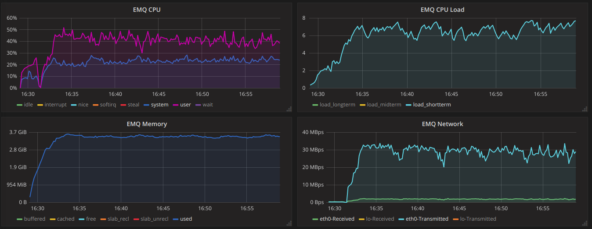

qos1-p10k-1-5K  EMQX服务器资源指标监控：

.. image:: _static/images/qos1-p10k-1-5K.png

-------------------
QoS2 Fan-In消息吞吐
-------------------

+-------------------------+-------+-----------+-------------------+---------------------+--------------------+------------+
|  组合场景ID             |  QoS  |  Payload  |  PUB连接 X Fan-In |  SUB连接 X Fan-Out  |  Fan-Out(平均吞吐) |  背景连接  |
+=========================+=======+===========+===================+=====================+====================+============+
| qos2-p256-20K-0         | 2     | 256       | 4k X 5            | 0                   | 14737              | 100K       |
+-------------------------+-------+-----------+-------------------+---------------------+--------------------+------------+
| qos2-p1K-10K-0          | 2     | 1K        | 2k X 5            | 0                   | 9228               | 100K       |
+-------------------------+-------+-----------+-------------------+---------------------+--------------------+------------+
| qos2-p10K-3k-0          | 2     | 10K       | 600 X 5           | 0                   | 2829               | 100K       |
+-------------------------+-------+-----------+-------------------+---------------------+--------------------+------------+

资源占用报告:

+-------------------------+-----------------------+------------------------+----------------+-------------+
| 组合场景ID              | 网络吞吐(Avg/Max Bps) | CPU负载(ShortLoad Max) | CPU(user/sys)  | Memory(Max) |
+=========================+=======================+========================+================+=============+
| qos2-p256-20K-0         | _/8.50M               | 7                      | 不超过42% / 20%| 2.10G       |
+-------------------------+-----------------------+------------------------+----------------+-------------+
| qos2-p1k-10K-0          | _/12.50M              | 5                      | 不超过32% / 13%| 1.95G       |
+-------------------------+-----------------------+------------------------+----------------+-------------+
| qos2-p10k-3k-0          | _/30.20M              | 3                      | 不超过17% / 6% | 1.97G       |
+-------------------------+-----------------------+------------------------+----------------+-------------+

qos2-p256-20K-0  EMQX服务器资源指标监控：

.. image:: _static/images/qos2-p256-20K-0.png

qos2-p1k-10K-0  EMQX服务器资源指标监控：

.. image:: _static/images/qos2-p1k-10K-0.png

qos2-p10k-3K-0  EMQX服务器资源指标监控：

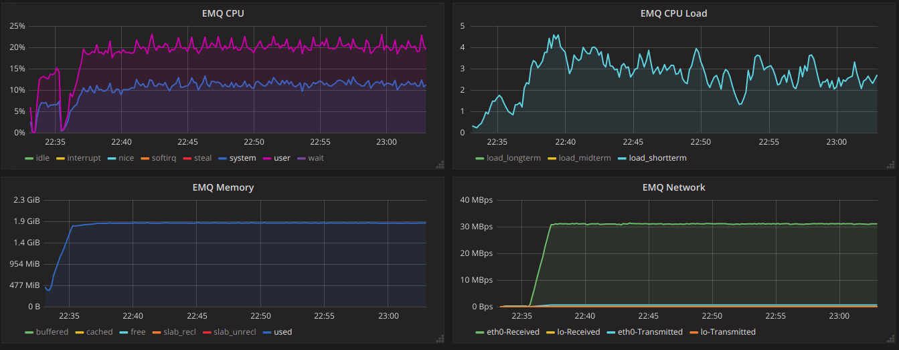

--------------------
QoS2 Fan-Out消息吞吐
--------------------

+-------------------------+-------+-----------+-------------------+---------------------+--------------------+------------+
|  组合场景ID             |  QoS  |  Payload  |  PUB连接 X Fan-In |  SUB连接 X Fan-Out  |  Fan-Out(平均吞吐) |  背景连接  |
+=========================+=======+===========+===================+=====================+====================+============+
| qos2-p256-4-20K         | 2     | 256       | 4 X 1             | 5K X 4              | 15916              | 100K       |
+-------------------------+-------+-----------+-------------------+---------------------+--------------------+------------+
| qos2-p1K-2-10K          | 2     | 1K        | 2 X 1             | 5K X 2              | 8387               | 100K       |
+-------------------------+-------+-----------+-------------------+---------------------+--------------------+------------+
| qos2-p10K-1-1K          | 2     | 10K       | 1 X 1             | 1K X 1              | 967                | 100K       |
+-------------------------+-------+-----------+-------------------+---------------------+--------------------+------------+

资源占用报告:

+-------------------------+-----------------------+------------------------+----------------+-------------+
| 组合场景ID              | 网络吞吐(Avg/Max Bps) | CPU负载(ShortLoad Max) | CPU(user/sys)  | Memory(Max) |
+=========================+=======================+========================+================+=============+
| qos2-p256-4-20K         | _/9.50M               | 5                      | 不超过40% / 13%| 2.15G       |
+-------------------------+-----------------------+------------------------+----------------+-------------+
| qos2-p1k-2-10K          | _/13.00M              | 3                      | 不超过25% / 8% | 2.15G       |
+-------------------------+-----------------------+------------------------+----------------+-------------+
| qos2-p10k-1-1K          | _/10.05M              | 1.5                    | 不超过 7% / 3% | 1.96G       |
+-------------------------+-----------------------+------------------------+----------------+-------------+

qos2-p256-4-20K  EMQX服务器资源指标监控：

.. image:: _static/images/qos2-p256-4-20K.png

qos2-p1k-2-10K  EMQX服务器资源指标监控：

.. image:: _static/images/qos2-p1k-2-10K.png

qos2-p10k-1-1K  EMQX服务器资源指标监控：

.. image:: _static/images/qos2-p10k-1-1K.png

--------------
共享订阅
--------------

订阅方式: $queue/<topic> 或 $share/<group>/<topic>

+-------------------------+-------+-----------+-------------------+---------------------+---------------------+--------------------+-----------+
|  组合场景ID             |  QoS  |  Payload  |  PUB连接 X Fan-In |  SUB连接 X Fan-Out  |  Fan-In (平均值)    | Fan-Out(平均值)    |  背景连接 |
+=========================+=======+===========+===================+=====================+=====================+====================+===========+
| qos0-p64-20K-20K        | 0     | 64        | 2K X 10           | 10 X 2K             | 19057               | 19051              | 100K      |
+-------------------------+-------+-----------+-------------------+---------------------+---------------------+--------------------+-----------+
| qos0-p256-20K-20K       | 0     | 256       | 2K X 10           | 10 X 2K             | 19117               | 19112              | 100K      |
+-------------------------+-------+-----------+-------------------+---------------------+---------------------+--------------------+-----------+
| qos1-p64-15K-15K        | 1     | 64        | 1.5K X 10         | 10 X 1.5K           | 13999               | 13996              | 100K      |
+-------------------------+-------+-----------+-------------------+---------------------+---------------------+--------------------+-----------+
| qos1-p256-15K-15K       | 1     | 256       | 1.5K X 10         | 10 X 1.5K           | 13992               | 13953              | 100K      |
+-------------------------+-------+-----------+-------------------+---------------------+---------------------+--------------------+-----------+
| qos2-p64-10K-10K        | 2     | 64        | 1K X 10           | 10 X 1K             | 9114                | 9112               | 100K      |
+-------------------------+-------+-----------+-------------------+---------------------+---------------------+--------------------+-----------+
| qos2-p256-7K-7K         | 2     | 256       | 0.7K X 10         | 10 X 0.7K           | 6517                | 6516               | 100K      |
+-------------------------+-------+-----------+-------------------+---------------------+---------------------+--------------------+-----------+

资源占用报告:

+--------------------+-----------------------+------------+----------------+--------------+
|  组合场景ID        |网络吞吐(RX/TX Max Bps)| 负载(Load) | CPU(user/sys)  | Memory(Max)  |
+====================+=======================+============+================+==============+
| qos0-p64-20K-20K   | 4.84M/4.28M           | 7          | 不超过55% / 26%|   3.09G      |
+--------------------+-----------------------+------------+----------------+--------------+
| qos0-p256-20K-20K  | 8.52M/8.07M           | 8          | 不超过54% / 25%|   3.00G      |
+--------------------+-----------------------+------------+----------------+--------------+
| qos1-p64-15K-15K   | 4.52M/3.80M           | 8          | 不超过56% / 26%|   3.05G      |
+--------------------+-----------------------+------------+----------------+--------------+
| qos1-p256-15K-15K  | 7.32M/6.61M           | 8          | 不超过57% / 26%|   3.07G      |
+--------------------+-----------------------+------------+----------------+--------------+
| qos2-p64-10K-10K   | 4.68M/3.75M           | 8          | 不超过60% / 28%|   3.07G      |
+--------------------+-----------------------+------------+----------------+--------------+
| qos2-p256-7K-7K    | 610k/477K             | 5          | 不超过54% / 26%|   4.78G      |
+--------------------+-----------------------+------------+----------------+--------------+

qos0-p64-20K-20K  EMQX服务器资源指标监控：

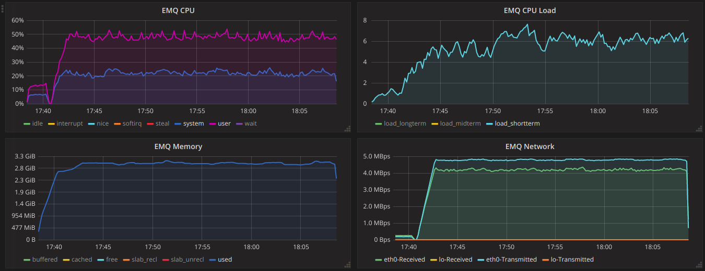

qos0-p256-20K-20K  EMQX服务器资源指标监控：

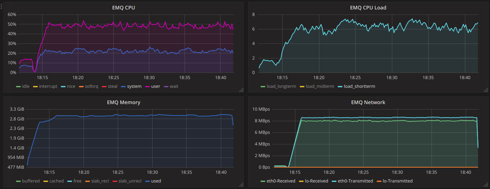

qos1-p64-15K-15K  EMQX服务器资源指标监控：

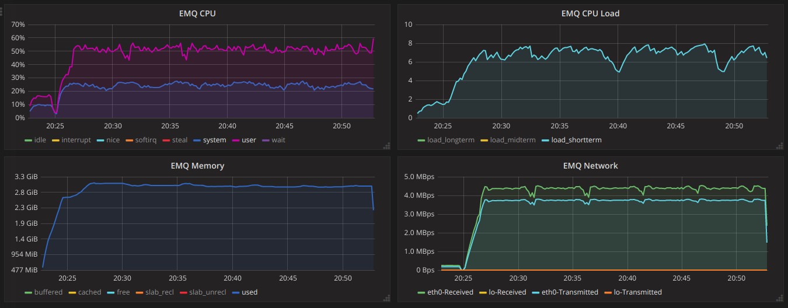

qos1-p256-15K-15K  EMQX服务器资源指标监控：

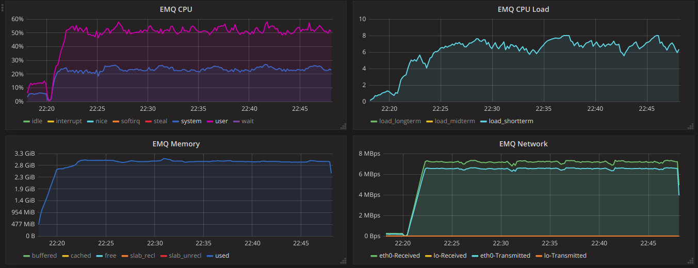

qos2-p64-10K-10K  EMQX服务器资源指标监控：

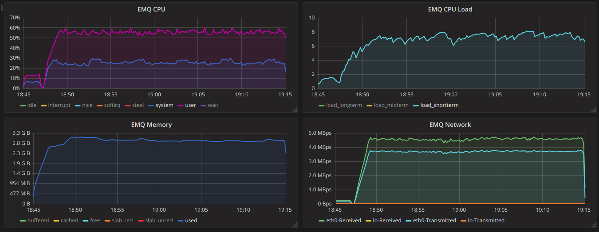

qos2-p256-7k-7K  EMQX服务器资源指标监控：

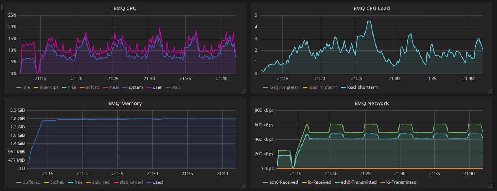
