.. _throughput_benchmark:

============
消息吞吐测试
============

EMQX消息吞吐测试组合条件：

+---------+-----------------------+------------------+-------------------+-------------+---------------+-----------+
|  QoS    |         Payload       | PUB连接 x Fan-In | SUB连接 X Fan-Out |  实际Fan-In |  实际Fan-Out  |  背景连接 |
+=========+=======================+==================+===================+=============+===============+===========+
| 0/1/2   | 64B/256B/1k/10K/100k  | C x Msg/s        | C x Msg/s         | Msg/s, Bps  | Msg/s, Bps    | 100K      |
+---------+-----------------------+------------------+-------------------+-------------+---------------+-----------+

参数说明:

+----------+-----------------------+
|  参数    |   说明                |
+==========+=======================+
| C        | Connection连接数      |
+----------+-----------------------+
| Msg/s    | 每秒消息数量          |
+----------+-----------------------+
| Bps      | 网络吞吐(字节/秒)     |
+----------+-----------------------+

.. NOTE:: 吞吐测试在青云北京三区VPC进行，节点之间的网络带宽平均限制为1Gbps，峰值限制为2Gbps。

.. NOTE:: 1. 测试主机的内核TCP协议栈参数: https://developer.emqx.io/docs/emq/v3/en/tune.html

-------------------
QoS0 Fan-In消息吞吐
-------------------

测试客户端到EMQ服务器间的QoS0消息吞吐:

+------------------------+-------+-----------+-------------------+---------------------+------------------+-----------------+-----------+
| 组合场景ID             |  QoS  |  Payload  |  PUB连接 X Fan-In |  SUB连接 X Fan-Out  | Fan-In(平均吞吐) | 90%平均响应时间 |  背景连接 |
+========================+=======+===========+===================+=====================+==================+=================+===========+
| qos0-p256-40K-0        | 0     | 256       | 4K X 10           | 0                   | 34986             |      0s        | 100K      |
+------------------------+-------+-----------+-------------------+---------------------+------------------+-----------------+-----------+
| qos0-p1K-30K-0         | 0     | 1K        | 3K X 10           | 0                   | 26533             |      0s        | 100K      |
+------------------------+-------+-----------+-------------------+---------------------+------------------+-----------------+-----------+
| qos0-p10K-10K-0        | 0     | 10K       | 1K X 10           | 0                   | 8963              |      0s        | 100K      |
+------------------------+-------+-----------+-------------------+---------------------+------------------+-----------------+-----------+
| qos0-p100K-1K-0        | 0     | 100K      | 1K X 1            | 0                   | 957               |   0.0002s      | 100K      |
+------------------------+-------+-----------+-------------------+---------------------+------------------+-----------------+-----------+

资源占用报告:

+-------------------------+-----------------------+------------------------+----------------+-------------+
| 组合场景ID              | 网络吞吐(Avg/Max Bps) | CPU负载(ShortLoad Max) | CPU(user/sys)  | Memory(Max) |
+=========================+=======================+========================+================+=============+
| qos0-p256-40K-0         | _/13.50M              | 6                      | 不超过45% / 25%| 2.10G       |
+-------------------------+-----------------------+------------------------+----------------+-------------+
| qos0-p1K-30K-0          | _/31.72M              | 6                      | 不超过38% / 20%| 2.08G       |
+-------------------------+-----------------------+------------------------+----------------+-------------+
| qos0-p10K-10K-0         | _/96.50M              | 4                      | 不超过32% / 12%| 2.10G       |
+-------------------------+-----------------------+------------------------+----------------+-------------+
| qos0-p100K-1K-0         | _/103.00M             | 5                      | 不超过33% / 8% | 2.41G       |
+-------------------------+-----------------------+------------------------+----------------+-------------+

qos0-p256-40K-0 EMQX服务器资源监控：

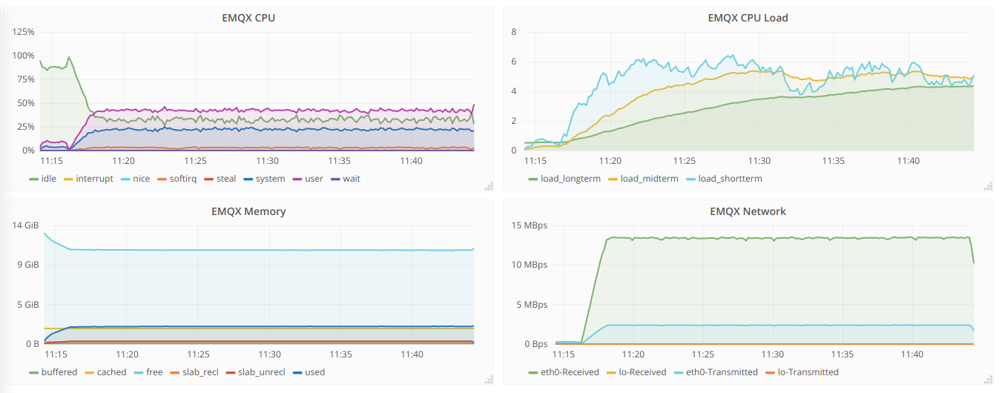

qos0-p1K-30K-0 EMQX服务器资源监控：

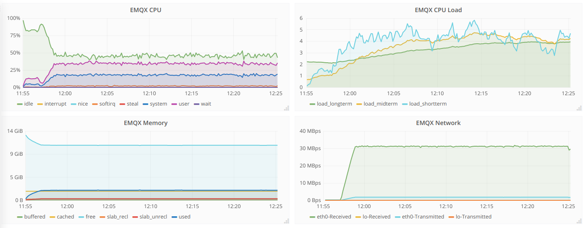

qos0-p10K-10K-0 EMQX服务器资源监控：

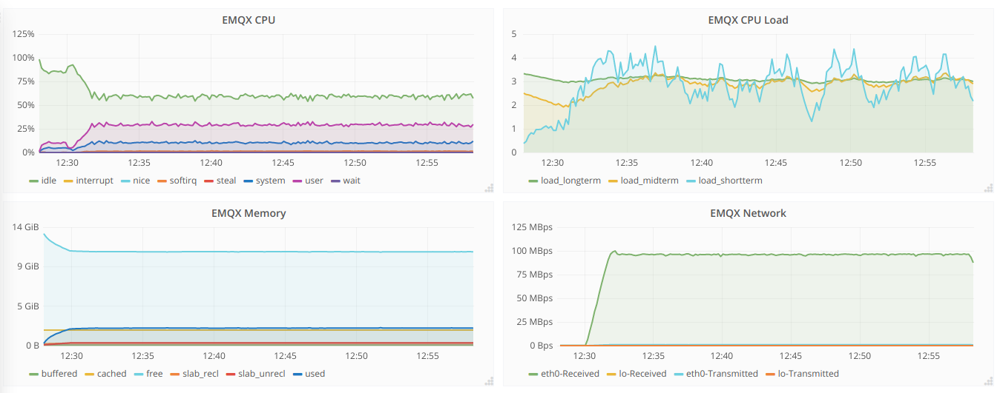

qos0-p100K-1K-0 EMQX服务器资源监控：

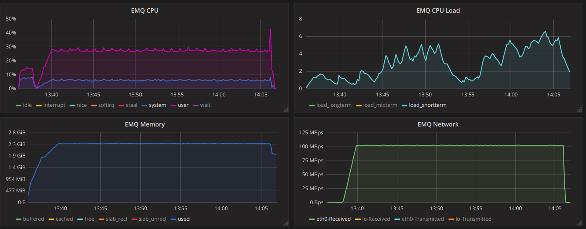

--------------------
QoS0 Fan-Out消息吞吐
--------------------

+------------------------+-------+-----------+-------------------+---------------------+------------------+-----------------+-----------+
| 组合场景ID             |  QoS  |  Payload  |  PUB连接 X Fan-In |  SUB连接 X Fan-Out  | Fan-In(平均吞吐) | 90%平均响应时间 |  背景连接 |
+========================+=======+===========+===================+=====================+==================+=================+===========+
| qos0-p256-4-40K        | 0     | 256       | 4 X 1             | 10K X 4             | 39381             |  0.0663s        | 100K      |
+------------------------+-------+-----------+-------------------+---------------------+------------------+-----------------+-----------+
| qos0-p1K-3-30K         | 0     | 1K        | 3 X 1             | 10K X 3             | 29687             |  0.0585s        | 100K      |
+------------------------+-------+-----------+-------------------+---------------------+------------------+-----------------+-----------+
| qos0-p10K-1-10K        | 0     | 10K       | 1 X 1             | 10K X 1             | 7902              |  0.4051s        | 100K      |
+------------------------+-------+-----------+-------------------+---------------------+------------------+-----------------+-----------+
| qos0-p100K-1-1K        | 0     | 100K      | 1 X 1             | 1K X 1              | 989               |  0.2885s        | 100K      |
+------------------------+-------+-----------+-------------------+---------------------+------------------+-----------------+-----------+

资源占用报告:

+-------------------------+-----------------------+------------------------+----------------+-------------+
| 组合场景ID              | 网络吞吐(Avg/Max Bps) | CPU负载(ShortLoad Max) | CPU(user/sys)  | Memory(Max) |
+=========================+=======================+========================+================+=============+
| qos0-p256-4-40K         | _/23.00M              | 5                      | 不超过32% / 9% | 2.43G       |
+-------------------------+-----------------------+------------------------+----------------+-------------+
| qos0-p1K-3-30K          | _/47.20M              | 6                      | 不超过30% / 10%| 2.56G       |
+-------------------------+-----------------------+------------------------+----------------+-------------+
| qos0-p10K-1-10K         | _/109.60M             | 2                      | 不超过15% / 6% | 2.42G       |
+-------------------------+-----------------------+------------------------+----------------+-------------+
| qos0-p100K-1-1K         | _/105.00M             | 1                      | 不超过 8% / 3% | 2.02G       |
+-------------------------+-----------------------+------------------------+----------------+-------------+

qos0-p256-4-40K  EMQX服务器资源监控：

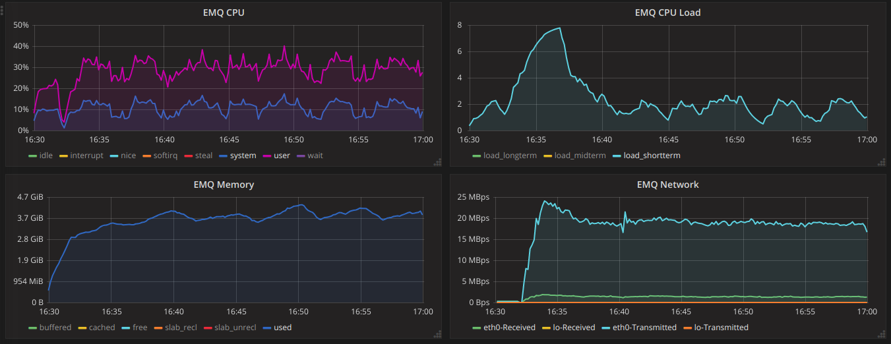

qos0-p1K-3-30K  EMQX服务器资源监控：

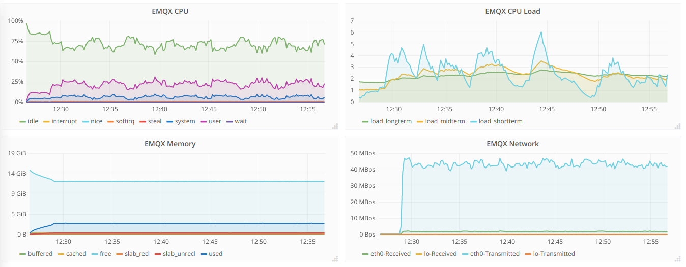

qos0-p10K-1-10K  EMQX服务器资源监控：

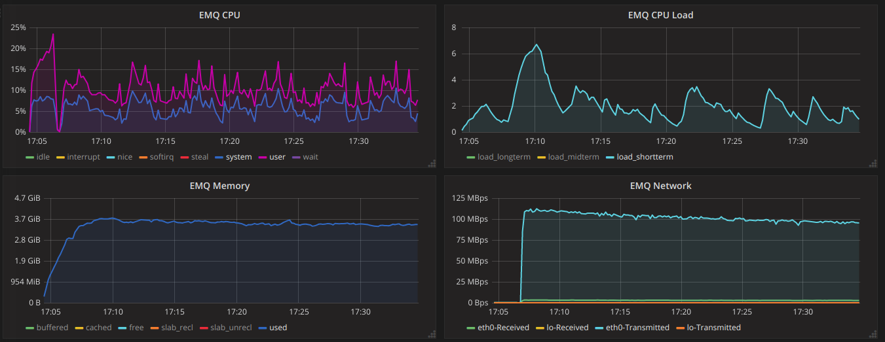

qos0-p100K-1-1K  EMQX服务器资源监控：

.. image:: _static/images/qos0-p100K-1-1K.png

-------------------
QoS1 Fan-In消息吞吐
-------------------

+------------------------+-------+-----------+-------------------+---------------------+------------------+-----------------+-----------+
| 组合场景ID             |  QoS  |  Payload  |  PUB连接 X Fan-In |  SUB连接 X Fan-Out  | Fan-In(平均吞吐) | 90%平均响应时间 |  背景连接 |
+========================+=======+===========+===================+=====================+==================+=================+===========+
| qos1-p256-30K-0        | 1     | 256       | 3K X 10           | 0                   | 23305             |    0.0007s     | 100K      |
+------------------------+-------+-----------+-------------------+---------------------+------------------+-----------------+-----------+
| qos1-p1K-20K-0         | 1     | 1K        | 2K X 10           | 0                   | 17097             |    0.0006s     | 100K      |
+------------------------+-------+-----------+-------------------+---------------------+------------------+-----------------+-----------+
| qos1-p10K-5K-0         | 1     | 10K       | 1K X 5            | 0                   | 4378              |    0.0023s     | 100K      |
+------------------------+-------+-----------+-------------------+---------------------+------------------+-----------------+-----------+

资源占用报告:

+-------------------------+-----------------------+------------------------+----------------+-------------+
| 组合场景ID              | 网络吞吐(Avg/Max Bps) | CPU负载(ShortLoad Max) | CPU(user/sys)  | Memory(Max) |
+=========================+=======================+========================+================+=============+
| qos1-p256-30K-0         | _/10.74M              | 6                      | 不超过38% / 22%| 2.70G       |
+-------------------------+-----------------------+------------------------+----------------+-------------+
| qos1-p1K-20K-0          | _/21.41M              | 6                      | 不超过30% / 18%| 1.83G       |
+-------------------------+-----------------------+------------------------+----------------+-------------+
| qos1-p10K-5K-0          | _/48.50M              | 4                      | 不超过27% / 12%| 2.10G       |
+-------------------------+-----------------------+------------------------+----------------+-------------+

qos1-p256-30K-0 EMQX服务器资源监控：

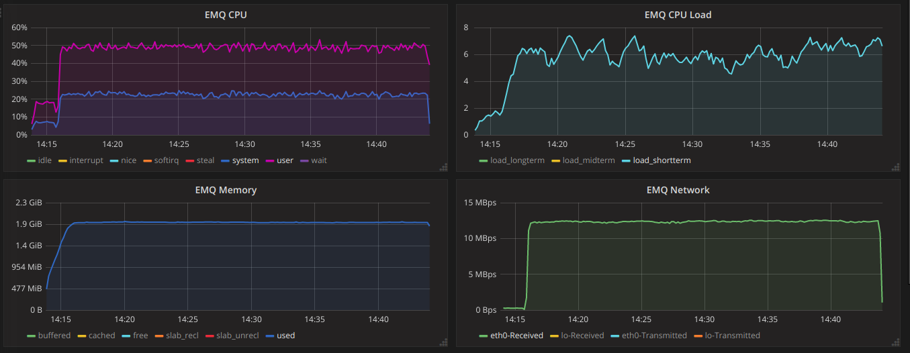

qos1-p1K-20K-0 EMQX服务器资源监控：

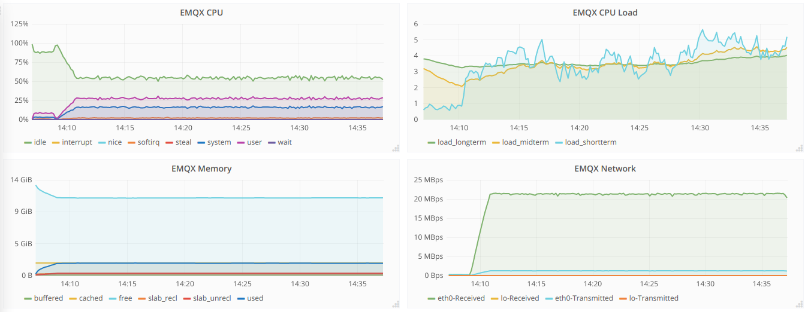

qos1-p10K-5K-0 EMQX服务器资源监控：

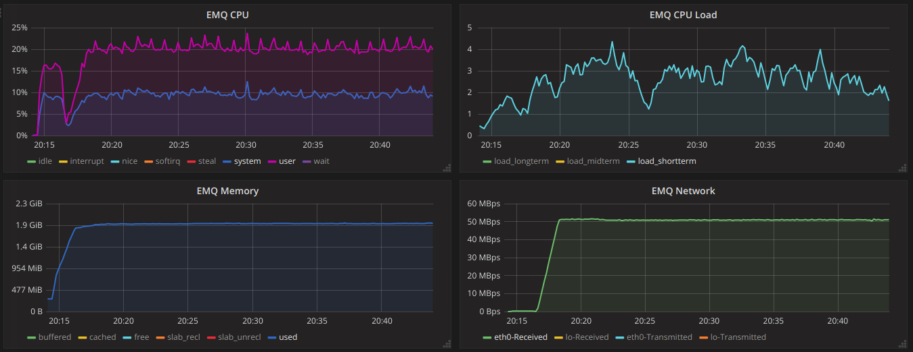

--------------------
QoS1 Fan-Out消息吞吐
--------------------

+------------------------+-------+-----------+-------------------+---------------------+------------------+-----------------+-----------+
| 组合场景ID             |  QoS  |  Payload  |  PUB连接 X Fan-In |  SUB连接 X Fan-Out  | Fan-In(平均吞吐) | 90%平均响应时间 |  背景连接 |
+========================+=======+===========+===================+=====================+==================+=================+===========+
| qos1-p256-4-40K        | 1     | 256       | 4 X 1             | 10K X 4             | 33417             |  0.1165s        | 100K      |
+------------------------+-------+-----------+-------------------+---------------------+------------------+-----------------+-----------+
| qos1-p1K-3-30K         | 1     | 1K        | 3 X 1             | 10K X 3             | 25042             |  0.0899s        | 100K      |
+------------------------+-------+-----------+-------------------+---------------------+------------------+-----------------+-----------+
| qos1-p10K-1-5K         | 1     | 10K       | 1 X 1             | 5K X 1              | 4081              |  0.1883s        | 100K      |
+------------------------+-------+-----------+-------------------+---------------------+------------------+-----------------+-----------+

资源占用报告:

+-------------------------+-----------------------+------------------------+----------------+-------------+
| 组合场景ID              | 网络吞吐(Avg/Max Bps) | CPU负载(ShortLoad Max) | CPU(user/sys)  | Memory(Max) |
+=========================+=======================+========================+================+=============+
| qos1-p256-4-40K         | _/15.56M              | 6                      | 不超过50% / 15%| 2.52G       |
+-------------------------+-----------------------+------------------------+----------------+-------------+
| qos1-p1k-3-30K          | _/32.70M              | 5                      | 不超过40% / 12%| 2.52G       |
+-------------------------+-----------------------+------------------------+----------------+-------------+
| qos1-p10k-1-5K          | _/53.60M              | 3                      | 不超过20% / 8% | 2.20G       |
+-------------------------+-----------------------+------------------------+----------------+-------------+

qos1-p256-4-40K  EMQX服务器资源指标监控：

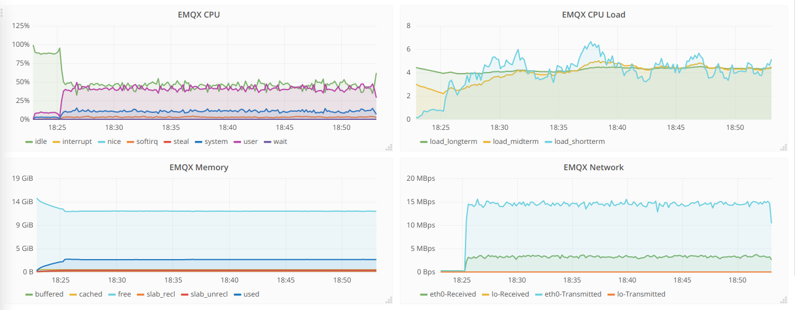

qos1-p1k-3-30K  EMQX服务器资源指标监控：

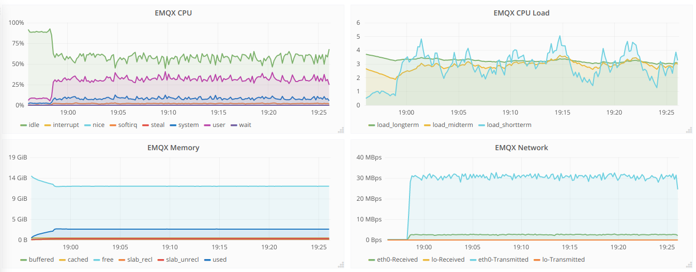

qos1-p10k-1-5K  EMQX服务器资源指标监控：

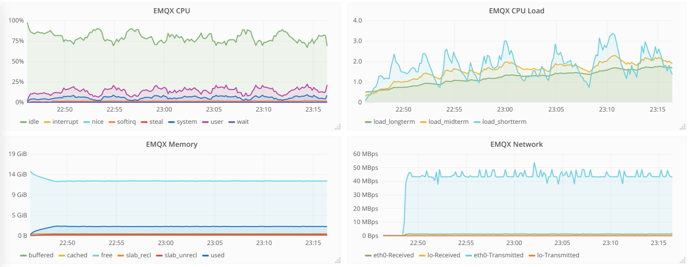

-------------------
QoS2 Fan-In消息吞吐
-------------------

+------------------------+-------+-----------+-------------------+---------------------+------------------+-----------------+-----------+
| 组合场景ID             |  QoS  |  Payload  |  PUB连接 X Fan-In |  SUB连接 X Fan-Out  | Fan-In(平均吞吐) | 90%平均响应时间 |  背景连接 |
+========================+=======+===========+===================+=====================+==================+=================+===========+
| qos2-p256-20K-0        | 2     | 256       | 4K X 5            | 0                   | 14361             |    0.0067s     | 100K      |
+------------------------+-------+-----------+-------------------+---------------------+------------------+-----------------+-----------+
| qos2-p1K-10K-0         | 2     | 1K        | 2K X 5            | 0                   | 8926              |    0.0014s     | 100K      |
+------------------------+-------+-----------+-------------------+---------------------+------------------+-----------------+-----------+
| qos2-p10K-3K-0         | 2     | 10K       | 600 X 5           | 0                   | 2741              |    0.0017s     | 100K      |
+------------------------+-------+-----------+-------------------+---------------------+------------------+-----------------+-----------+

资源占用报告:

+-------------------------+-----------------------+------------------------+----------------+-------------+
| 组合场景ID              | 网络吞吐(Avg/Max Bps) | CPU负载(ShortLoad Max) | CPU(user/sys)  | Memory(Max) |
+=========================+=======================+========================+================+=============+
| qos2-p256-20K-0         | _/8.64M               | 7                      | 不超过43% / 20%| 2.12G       |
+-------------------------+-----------------------+------------------------+----------------+-------------+
| qos2-p1k-10K-0          | _/12.62M              | 5                      | 不超过33% / 14%| 1.96G       |
+-------------------------+-----------------------+------------------------+----------------+-------------+
| qos2-p10k-3k-0          | _/30.90M              | 3                      | 不超过18% / 7% | 2.02G       |
+-------------------------+-----------------------+------------------------+----------------+-------------+

qos2-p256-20K-0  EMQX服务器资源指标监控：

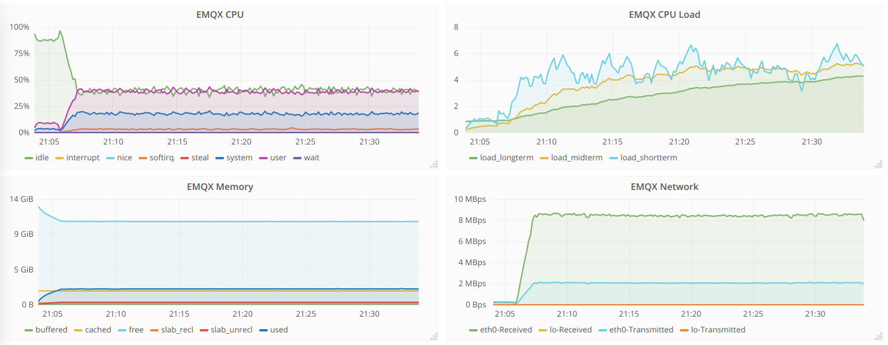

qos2-p1k-10K-0  EMQX服务器资源指标监控：

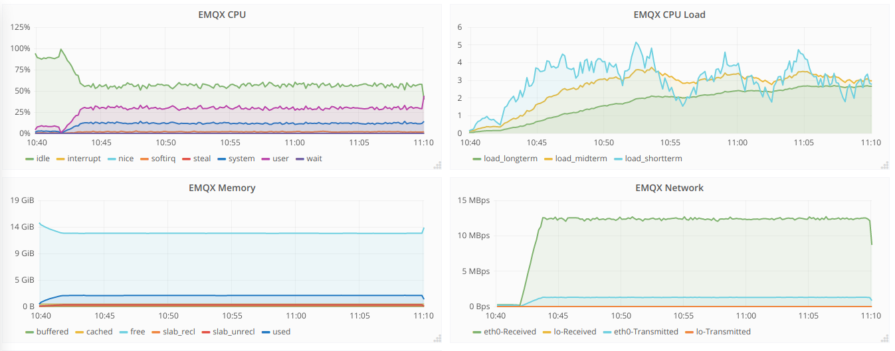

qos2-p10k-3K-0  EMQX服务器资源指标监控：

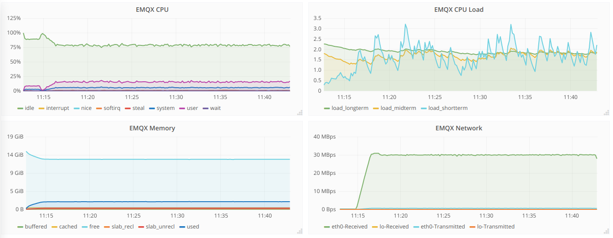

--------------------
QoS2 Fan-Out消息吞吐
--------------------

+------------------------+-------+-----------+-------------------+---------------------+------------------+-----------------+-----------+
| 组合场景ID             |  QoS  |  Payload  |  PUB连接 X Fan-In |  SUB连接 X Fan-Out  | Fan-In(平均吞吐) | 90%平均响应时间 |  背景连接 |
+========================+=======+===========+===================+=====================+==================+=================+===========+
| qos2-p256-4-20K        | 2     | 256       | 4 X 1             | 5K X 4              | 15883             |    0.0847s     | 100K      |
+------------------------+-------+-----------+-------------------+---------------------+------------------+-----------------+-----------+
| qos2-p1K-2-10K         | 2     | 1K        | 2 X 1             | 5K X 2              | 8241              |    0.0547s     | 100K      |
+------------------------+-------+-----------+-------------------+---------------------+------------------+-----------------+-----------+
| qos2-p10K-1-1K         | 2     | 10K       | 1 X 1             | 1K X 1              | 966               |    0.0322s     | 100K      |
+------------------------+-------+-----------+-------------------+---------------------+------------------+-----------------+-----------+

资源占用报告:

+-------------------------+-----------------------+------------------------+----------------+-------------+
| 组合场景ID              | 网络吞吐(Avg/Max Bps) | CPU负载(ShortLoad Max) | CPU(user/sys)  | Memory(Max) |
+=========================+=======================+========================+================+=============+
| qos2-p256-4-20K         | _/9.85M               | 5                      | 不超过40% / 14%| 2.18G       |
+-------------------------+-----------------------+------------------------+----------------+-------------+
| qos2-p1k-2-10K          | _/13.73M              | 4                      | 不超过27% / 9% | 2.19G       |
+-------------------------+-----------------------+------------------------+----------------+-------------+
| qos2-p10k-1-1K          | _/10.91M              | 1                      | 不超过 8% / 3% | 1.97G       |
+-------------------------+-----------------------+------------------------+----------------+-------------+

qos2-p256-4-20K  EMQX服务器资源指标监控：

.. image:: _static/images/qos2-p256-4-20K.png

qos2-p1k-2-10K  EMQX服务器资源指标监控：

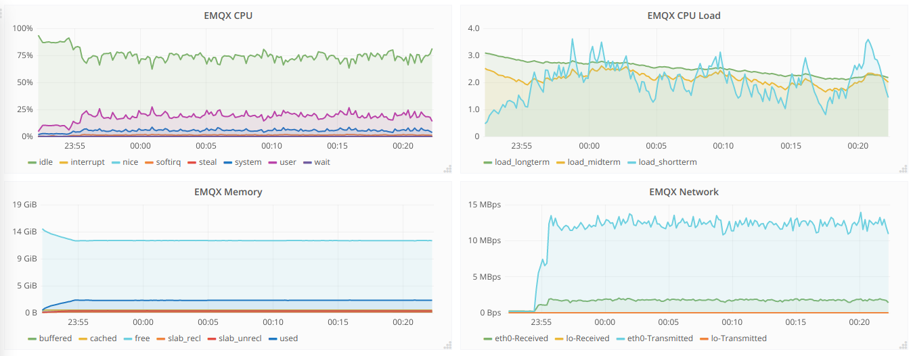

qos2-p10k-1-1K  EMQX服务器资源指标监控：

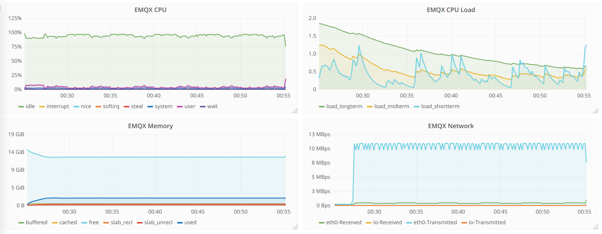
